# AWS for Telegator — a learning guide

**Who this is for.** Someone new to AWS who wants to read this repository and
understand it. No cloud experience is assumed. English is kept simple and
sentences are kept short.

**What this is.** Every AWS idea that appears in `docs/` or in the code, with a
one-line definition, a diagram of how the ideas connect, and a pointer to the
file where you can see it in real use.

**How to read it.**

1. Read section 1 and 2. That is enough to follow any other section.
2. Then read only the section you need. Each one stands alone.
3. Words in a glossary table are defined once. If a definition uses another
   defined word, the section that defines it is named in the same row.

**Three labels appear next to each concept:**

| Label | Meaning |
| --- | --- |
| **built** | It exists in the code today. You can open the file. |
| **planned** | It is designed in `docs/superpowers/specs/2026-08-30-fargate-app-stack-design.md` but not built yet. |
| **context** | AWS offers it. Telegator does not use it. It is here so you know the word. |

> **A note on the design document.** `docs/telegator-design.md` is the
> specification and must not be edited. Where the code does something different,
> the code says why in a comment. This guide follows the same rule: when code and
> spec disagree, this guide describes the code and names the reason.

---

## 1. Ten words to learn first

Everything else is built from these.

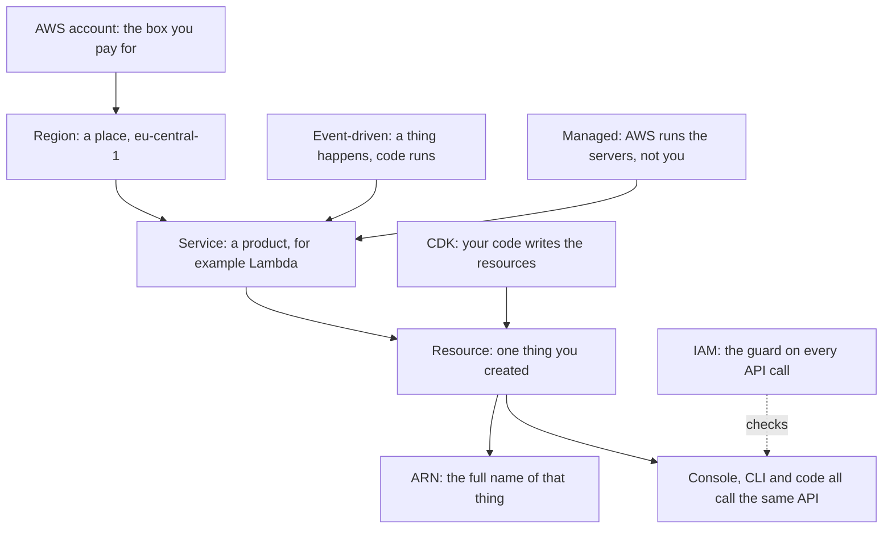

| Term | One-line meaning |
| --- | --- |
| **Account** | The box that owns and pays for everything you create; the strongest wall in AWS |
| **Region** | A group of data centres in one part of the world; Telegator uses `eu-central-1` (Frankfurt) only |
| **Availability Zone** | One data centre inside a Region, with its own power and network; two zones rarely fail together |
| **Service** | One AWS product, such as Lambda or DynamoDB; each has its own API |
| **Resource** | One thing you made with a Service: a queue, a table, a function |
| **ARN** | The full unique name of a Resource, like `arn:aws:sqs:eu-central-1:1234:telegator-dev-analyze`; permissions are written against ARNs |
| **API call** | Every action in AWS is an API call, whether you click the console, type the CLI, or run code |
| **IAM** | The guard that says yes or no to every API call — see [section 4](#4-iam-who-may-do-what) |
| **Managed service** | AWS runs and patches the servers; you only bring configuration and code |
| **Serverless** | A managed service that also costs nothing when nothing happens; Lambda, SQS and DynamoDB on-demand are all serverless |
| **Event-driven** | Code runs because something happened (a message arrived), not because a clock told it to |
| **Infrastructure as code** | You describe resources in a programming language, and a tool creates them — see [section 11](#11-cdk-and-cloudformation) |

**Telegator is serverless and event-driven.** Nothing runs while nothing
happens. That is the single idea the whole design is built on.

---

## 2. The whole system in one picture

Telegator reads posts from Telegram channels, asks an AI model to describe each
post, joins posts about the same story together, and publishes one message back
to Telegram. A web dashboard lets a person watch and fix things.

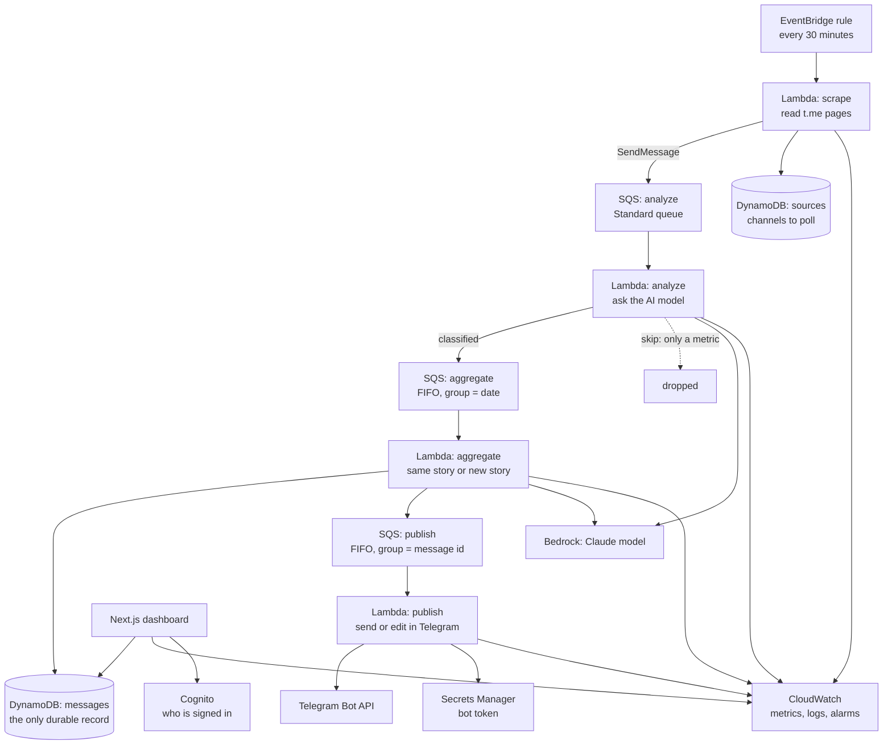

Three things in that picture are worth saying in words, because they explain
many later decisions:

1. **A post in transit is a queue message, not a database row.** It becomes a
   row only when it joins a story. So a post that is skipped leaves no row
   anywhere — only a metric and a log line.
2. **Because of that, CloudWatch is the record of volume.** Counting rows would
   count the wrong thing. This makes metrics a working part, not decoration.
3. **The dashboard never calls the pipeline code directly.** It reads the same
   tables and can invoke two Lambdas by name. A test enforces this wall.

---

## 3. Accounts, Regions and names

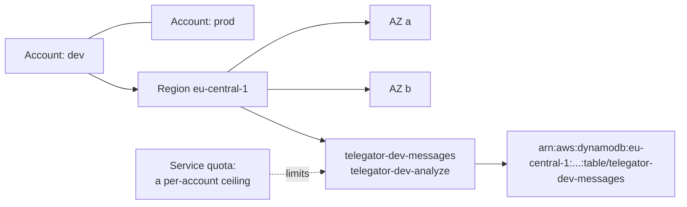

| Concept | One-line meaning | Status |
| --- | --- | --- |
| **Environment separation** | `dev` and `prod` are separate Accounts, so a mistake in one cannot touch the other | built — `infra/lib/config.ts` |
| **Resource name** | `telegator-{env}-{resource}`, so a name in a console or a log says which environment made it | built — `infra/lib/naming.ts` |
| **Service quota** | A limit per Account and Region on how many of a thing you may have | built as a *problem*: see the concurrency trap in [section 15](#15-traps-this-project-actually-hit) |
| **Partition** | The part of an ARN that says which AWS world you are in (`aws`, `aws-cn`, `aws-us-gov`); code writes `Aws.PARTITION` instead of the literal | built — `infra/lib/pipeline-stack.ts` |
| **Organization / Organizational Unit / Service Control Policy** | A tree of Accounts, and rules that *remove* permissions from all of them at once | context — but it bit this project: Bedrock was blocked at the Organization level, above IAM |
| **Tag** | A key/value label on a Resource, used for cost reports and access rules | context |

---

## 4. IAM — who may do what

IAM is the most important service to understand, because every other section
depends on it. The rule is simple: **every API call is denied unless a policy
allows it, and an explicit deny always wins.**

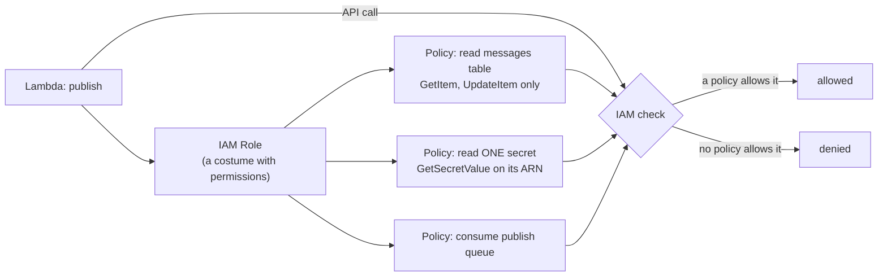

| Concept | One-line meaning | Status |
| --- | --- | --- |
| **IAM** | The permission system every AWS API call passes through; deny by default | built — everywhere |
| **Policy** | A JSON list of statements: *effect* (allow/deny), *action* (`dynamodb:Query`), *resource* (an ARN), optional *condition* | built — `infra/lib/grants.ts` |
| **Role** | A named set of permissions with no password of its own; a service "assumes" it and gets short-lived keys | built — one Role per Lambda, one for the dashboard |
| **Principal** | Whoever is making the call: a role session, a user, or an AWS service | built |
| **Service principal** | An AWS service allowed to assume a Role, e.g. `amplify.amazonaws.com`; planned: `ecs-tasks.amazonaws.com` | built — `infra/lib/app-stack.ts` |
| **Least privilege** | Grant only the exact actions a piece of code actually calls, on the exact ARNs it touches | built — the project's signature habit |
| **Trust policy** | The statement on a Role saying *who* may put the costume on | built (written by CDK for you) |
| **Condition** | An extra check on a statement, used when the action takes no ARN — e.g. `PutMetricData` limited to the `Telegator` namespace | built — `infra/lib/pipeline-stack.ts` |
| **Resource policy** | A policy attached to the *resource* instead of the caller; how a queue lets another account send to it | context |
| **STS** | The service that hands out the short-lived keys when a Role is assumed | context — it works underneath, you never call it here |

**How least privilege looks in this repo.** The spec says publish may
"read/write messages". The CDK helper for that would also grant `DeleteItem`.
The code grants only `GetItem` and `UpdateItem` — because the `messages` table
is the *only* record of a post, and a stage that never deletes should not be
able to. Read the comment in [pipeline-stack.ts](../infra/lib/pipeline-stack.ts);
it is a small masterclass.

**Two traps worth remembering:**

- Some actions take no resource ARN at all (`cloudwatch:PutMetricData`,
  `cloudwatch:GetMetricData`, `logs:GetQueryResults`). The only honest scope is
  `*` plus a condition where one exists.
- A DynamoDB `Query` on an index checks the **index ARN**, not the table ARN. A
  grant on the table alone passes every test and fails at runtime. This is why
  `infra/lib/grants.ts` exists.

---

## 5. Lambda — code that runs only when needed

**One-line meaning:** you upload a function; AWS runs it when an event arrives,
bills per millisecond, and runs nothing between events. All status: **built**.

- **Benefit** — zero cost while idle (a perfect match for a pipeline that
  sleeps most of the day), scaling that follows the queues automatically, and
  no server to patch — the runtime is AWS's problem.
- **Tradeoffs** — an invocation may run at most 15 minutes (here capped at
  300 s); a rarely-used function pays a cold-start delay; and local execution
  is never quite the real thing, which is why every AWS boundary here is a
  port with an in-memory fake.
- **Traps**
  - **Reserved concurrency needs quota headroom.** A reservation is only
    creatable while the account keeps 5 unreserved executions — and a cold
    account's *entire* quota is 5, so every reservation is rejected and the
    stack cannot be created. Hence the `reserveConcurrency` escape hatch in
    `infra/lib/config.ts`.
  - **`AWS_REGION` is reserved.** Lambda sets it; CloudFormation rejects a
    template that declares it. Read it, never write it.
  - **Bundling falls back to Docker.** Without a local esbuild, CDK builds the
    bundle in a container — which this machine does not have. The dependency
    plus `forceDockerBundling: false` keeps `cdk synth` self-contained.

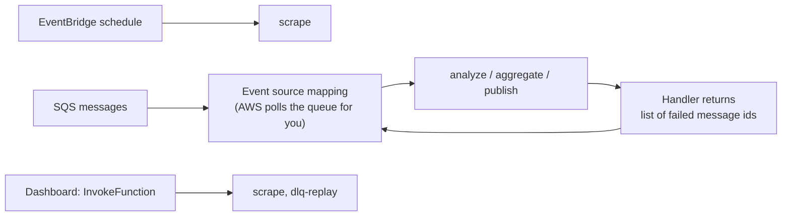

The five functions (defined in [pipeline-stack.ts](../infra/lib/pipeline-stack.ts),
handlers in `handlers/`):

| Function | Trigger | What it does |
| --- | --- | --- |
| `scrape` | Schedule, every 30 min | Reads Telegram channel pages, sends new posts to the analyze queue |
| `analyze` | SQS analyze queue | Asks the AI model to classify each post |
| `aggregate` | SQS aggregate queue (FIFO) | Decides: same story as an existing message, or a new one |
| `publish` | SQS publish queue (FIFO) | Sends or edits the Telegram message |
| `dlq-replay` | Manual, from the dashboard | Moves failed messages back to their source queue |

| Concept | One-line meaning |
| --- | --- |
| **Handler** | The exported function AWS calls with the event; here always named `handler` in `handlers/*.ts` |
| **Runtime** | The language image the function runs on; here Node.js 22 |
| **Architecture** | The CPU type; here ARM64 (Graviton) — cheaper, and native to the Apple Silicon build machine |
| **Timeout** | The longest one invocation may run; here 300 s on every function |
| **Memory size** | The RAM (and with it, CPU share) an invocation gets; 512 MB, except aggregate at 1024 MB |
| **Environment variable** | A named string given to the function at deploy time — table names, queue URLs; names live in `handlers/env.ts` |
| **Event source mapping** | The poller AWS runs against a queue on your behalf; you set batch size, it invokes the function with batches |
| **Batch size** | How many messages one invocation receives; 10 for analyze/aggregate, **1 for publish** (Telegram rate limits) |
| **Partial batch failure** | The handler returns only the ids that failed, so nine good messages are not retried because of one bad one |
| **Reserved concurrency** | A fixed cap on parallel copies of one function; scrape and dlq-replay get 1, analyze gets 5 |
| **Cold start** | Extra delay when AWS must create a fresh sandbox for the first invocation; harmless at this scale |
| **Bundling** | Packing the TypeScript into one JS file with esbuild at synth time; the AWS SDK is left out because the runtime ships it |

**Why partial batch failure matters here:** analyze receives 10 posts and calls
the AI model for each. Without `reportBatchItemFailures`, one bad post would
make AWS redeliver all 10 — and you would pay for nine successful model calls
again. One flag, real money.

**Concurrency without a number:** aggregate and publish have *no* reserved
concurrency. Their parallelism is controlled by FIFO message groups instead —
see the next section. The comment in the code calls a reserved concurrency of 1
"blunt": it would serialise across days too, which is more than correctness needs.

---

## 6. SQS — queues carry the work

**One-line meaning:** a durable mailbox between a producer and a consumer, so
they never need to be fast, alive, or awake at the same time. All status: **built**,
in [queue-stack.ts](../infra/lib/queue-stack.ts).

**The central design idea of the whole project:** the queue *is* the pipeline.
A post travels as a queue message and touches no table while in flight.

- **Benefit** — retry, back-pressure, failure isolation and a poison-message
  drawer, all for free; and at idle, no messages means no invocations and no
  cost. The table in `docs/telegator-design.md` §7.4 compares this to
  scheduled polling line by line — queues win every row.
- **Tradeoffs** — a message may arrive more than once (Standard) so consumers
  must tolerate repeats; FIFO buys order at a throughput cap (300 msg/s
  unbatched — orders of magnitude above the need here); a message body maxes
  out at 256 KB; and 14 days is the *longest* anything can wait.
- **Traps**
  - **Visibility timeout too short is silent double-processing.** A slow
    worker's message reappears and a second worker takes it. The 6× rule
    exists for exactly this.
  - **A FIFO queue's DLQ must itself be FIFO** — an AWS rule the spec did not
    state; the code learned it.
  - **Content-based deduplication is a trap for news.** Hashing the body would
    collapse two genuinely different posts with identical text; it is
    explicitly off, with an explicit id instead.
  - **FIFO delay is queue-level only.** The spec wanted a per-message settle
    delay; SQS FIFO only offers one number for the whole queue, so it became a
    stack parameter.

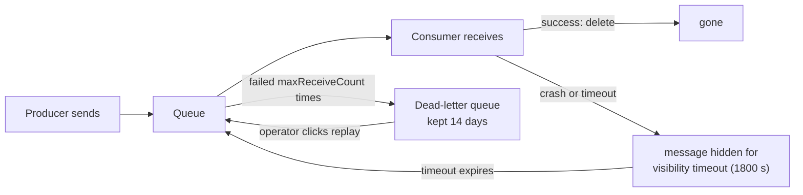

| Concept | One-line meaning |
| --- | --- |
| **Standard queue** | Best-effort order, unlimited throughput, possible rare duplicates; used for analyze, where no post depends on another |
| **FIFO queue** | Strict order and exactly-once *within a message group*; the name must end `.fifo`; used for aggregate and publish |
| **Message group** | The unit of order in a FIFO queue: one group is processed one message at a time, different groups run in parallel |
| **Deduplication id** | FIFO refuses a second message with the same id within 5 minutes; set explicitly here, never from a body hash |
| **Visibility timeout** | How long a received message stays hidden; here 1800 s = 6 × the Lambda timeout, per AWS guidance, so a slow worker is not doubled |
| **Dead-letter queue (DLQ)** | Where a message goes after failing too many times, instead of blocking the queue forever |
| **maxReceiveCount** | The "too many" number: 3 for analyze and aggregate, 5 for publish (Telegram errors are often temporary) |
| **Retention** | How long an unconsumed message survives: 14 days, the SQS maximum, on every queue and DLQ |
| **Delivery delay** | Messages become visible only after a wait; publish waits 300 s so a story can settle before its first send |
| **Queue depth** | `ApproximateNumberOfMessagesVisible` — how much work is waiting; the dashboard's health signal |

**Why the message groups are clever.** Aggregate must never process two posts
of the same day at the same time (they would both miss each other's write and
create duplicate stories). Group = *date* gives exactly that: one day is
serial, different days are parallel. Publish must never edit one Telegram
message twice at once. Group = *message id* gives exactly that, per message.

**Two FIFO rules AWS enforces and the spec did not know:**

- A FIFO queue's DLQ must itself be FIFO.
- A FIFO queue cannot have a batching window; CDK rejects it at synth. The code
  comment explains why losing it was safe here.

---

## 7. DynamoDB — the two tables

**One-line meaning:** a key-value database with the same speed at any size —
*if* you design the table around the questions you will ask it. Status: **built**,
in [data-stack.ts](../infra/lib/data-stack.ts).

- **Benefit** — no server, no connection pool, no capacity planning
  (`PAY_PER_REQUEST`), and read latency that stays flat whether the table
  holds a hundred stories or a hundred million.
- **Tradeoffs** — you must know your questions *before* designing the table:
  every cheap query is pre-built as a key or an index, and a question nobody
  planned for is a Scan. No joins, no ad-hoc SQL. Each GSI doubles the write
  cost of the attributes it projects.
- **Traps** — see the projection story below, plus: an item may not exceed
  400 KB (why the member list is capped, and why the old 1024-float embedding
  was packed into 4 KB of binary rather than a 20 KB number list); and a
  `Query` against an index authorises against the **index ARN**, not the
  table's — the trap `infra/lib/grants.ts` exists to close.

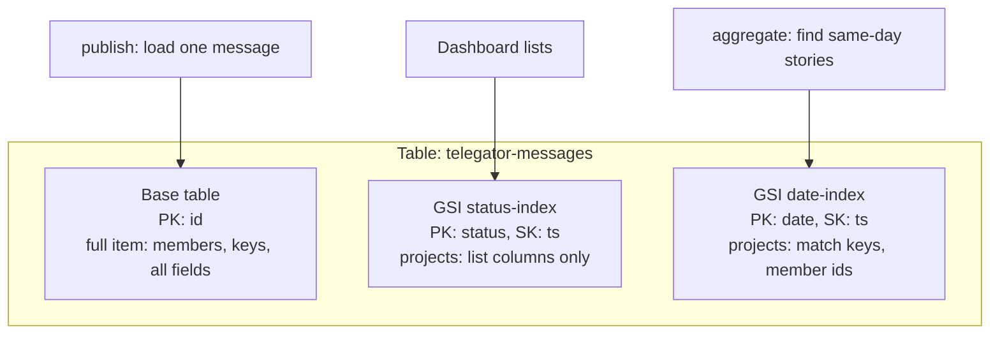

| Concept | One-line meaning |
| --- | --- |
| **Table** | A collection of items (rows) addressed by a key; here `sources` and `messages`, nothing else |
| **Item** | One record, a bag of attributes; no fixed schema — the Zod schemas in `lib/` are the real schema |
| **Partition key (PK)** | The attribute that decides where an item is stored; you can only fetch cheaply by it |
| **Sort key (SK)** | An optional second key that orders items within one partition value |
| **Global secondary index (GSI)** | A second copy of the table with a different key layout, kept in sync by AWS, so a second question becomes cheap |
| **Projection** | Which attributes a GSI copies; `INCLUDE` lists them, `ALL` copies everything — big attributes are excluded on purpose here |
| **On-demand billing** | `PAY_PER_REQUEST`: no capacity to guess, pay per read and write; both tables use it |
| **Query** | Fetch items by key, cheap and indexed; used for status lists and same-day dedup candidates |
| **Scan** | Read the whole table; acceptable only for the small `sources` table |
| **Point-in-time recovery (PITR)** | Continuous backup that can restore the table to any second in 35 days; on for `messages` |
| **Removal policy RETAIN** | Deleting the stack leaves the table alive; both tables outlive their stack on purpose |
| **Single-table design** | The advanced pattern of putting many entity types in one table; considered and *rejected* here — nothing is co-queried |

**Why projections are a cost decision.** Every attribute a GSI projects is
stored twice and written twice. The `messages` list index deliberately excludes
the two large attributes (`members`, and once, the embedding), so the dashboard
list stays cheap and the full item is read only when one message is opened.

**A trap already lived through (see also [section 15](#15-traps-this-project-actually-hit)):**
a GSI's projection **cannot be changed in place**. `cdk diff` shows a harmless
`[~]`, DynamoDB refuses the update. The fix is two deploys: one that deletes the
index, one that recreates it — documented in a long comment in
[data-stack.ts](../infra/lib/data-stack.ts).

---

## 8. EventBridge — the only clock

**One-line meaning:** a managed event router; here it is used for its simplest
skill — firing a rule on a schedule. Status: **built**, in
[pipeline-stack.ts](../infra/lib/pipeline-stack.ts) (`ScrapeSchedule`).

Telegram cannot push to us, so the edge of the system must poll. Everything
after that edge is event-driven. The design calls this
**"scheduled at the edge, event-driven internally"**.

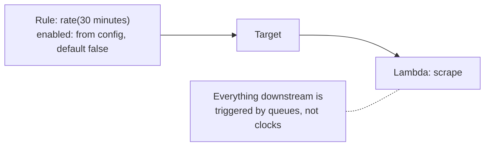

- **Benefit** — a cron job with no server to keep alive; if the target fails,
  the rule still fires next time; the `enabled` flag makes "deployed but quiet"
  a safe state.
- **Tradeoffs** — a schedule is a floor on latency (up to 30 minutes for a new
  post); AWS offers two products with confusingly similar names — the older
  *EventBridge Rules* (used here) and the newer *EventBridge Scheduler* (more
  features: time zones, one-off runs). The spec mentions both; the code chose
  `Rule` and its comment says why.
- **Traps**
  - The schedule defaults to **disabled in both environments**. This looks
    strange until you read §9.5: even the first *prod* deploy must run silently
    for 48 hours against test channels. A flag derived from the environment
    name ("prod = on") would start posting on day one. The safe default is off,
    and a deploy opts in with `-c scheduleEnabled=true`.
  - `rate(30 minutes)` is a fixed string format. A typo fails at deploy, not at
    synth.

---

## 9. Bedrock — calling the AI model

**One-line meaning:** Amazon Bedrock runs foundation models (Claude among them)
inside AWS, so calling a model is an AWS API call under IAM — no API key to
store. Status: **built** in [lib/ai/bedrock.ts](../lib/ai/bedrock.ts) and
[lib/ai/constants.ts](../lib/ai/constants.ts); live calls are currently blocked
at the account level (see Traps).

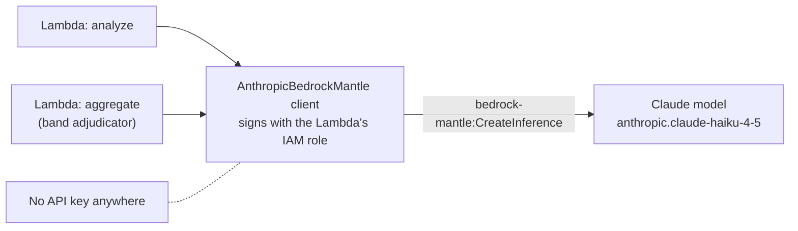

Two stages call a model:

| Caller | Purpose |
| --- | --- |
| `analyze` | Classify each post: category, country, title, skip-or-keep |
| `aggregate` | Adjudicate ambiguous "same story?" cases (the dedup band) |

There used to be a third use — embeddings for similarity — and it was removed:
dedup now compares deterministic match keys, and no embedding model is called
at all. The comment in `lib/ai/constants.ts` records this so nobody adds it back.

- **Benefit** — IAM replaces API keys: there is no secret to store, rotate or
  leak, and the permission is a normal policy statement like any other.
  Inference traffic stays inside AWS.
- **Tradeoffs** — model access is not automatic: an account must be granted
  access per model, sometimes with a use-case form; model choice is narrower
  than calling a provider directly; a Bedrock model id carries a prefix
  (`anthropic.claude-haiku-4-5`) that differs from the first-party API's id.
- **Traps** (this project hit all three)
  - **The permission must match the API actually called.** The spec grants
    `bedrock:InvokeModel`, but the `AnthropicBedrockMantle` client signs for a
    different service — `bedrock-mantle` — whose action is `CreateInference` on
    a *project* ARN. The role looked perfectly scoped and every call returned
    403. The fix is the `createInference()` statement in
    [pipeline-stack.ts](../infra/lib/pipeline-stack.ts).
  - **The Mantle grant cannot pin the model.** The model id travels in the
    request body, not the ARN, so IAM cannot restrict which model is used. The
    only guard is the single `CLASSIFIER_MODEL_ID` constant — a real loss of
    least privilege, recorded honestly in a comment.
  - **An Organization can veto the whole service.** This account sits in an AWS
    Organization where Bedrock is not enabled, so calls fail *above* IAM —
    no policy in this repository can fix that. Compare Amplify in
    [section 13](#13-the-hosting-story-amplify-app-runner-fargate): account
    standing beats correct code.

---

## 10. Cognito and Secrets Manager — signing in, and keeping secrets

### 10.1 Cognito — who is allowed into the dashboard

**One-line meaning:** a managed user directory plus ready-made login pages
(the "hosted UI"); your app never sees a password. Status: **built**, in
[auth-stack.ts](../infra/lib/auth-stack.ts) and `lib/auth/`.

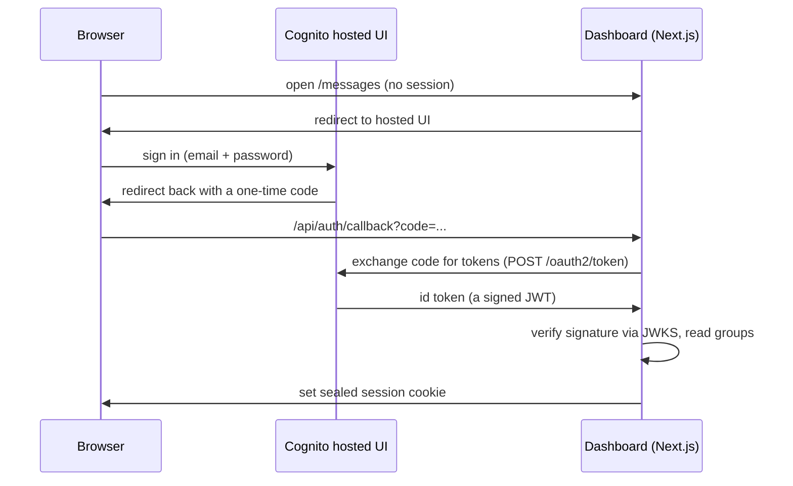

| Concept | One-line meaning |
| --- | --- |
| **User pool** | The user directory: accounts, passwords, groups |
| **App client** | One application's registration with the pool — its id, allowed callback URLs, allowed OAuth flows |
| **Hosted UI** | Cognito's own login pages on `<prefix>.auth.<region>.amazoncognito.com`; needs a domain to exist |
| **Authorization-code flow** | The browser gets a one-time code; the server swaps it for tokens; tokens never sit in a URL |
| **Callback URL** | Where Cognito may send the browser back to; anything not on the list is refused |
| **JWT / id token** | A signed statement of who the user is and which groups they are in |
| **JWKS** | The public keys used to check that signature, fetched from Cognito |
| **Group** | A named set of users; Telegator's roles (`admin`, `editor`, `viewer`) are groups |
| **Precedence** | Group ordering where a **lower number wins** — more privileged groups get lower numbers |
| **AdminCreateUser** | The only way into this pool: self-sign-up is disabled, an operator creates each user |

- **Benefit** — passwords, password reset, login pages and token signing are
  all AWS's problem; the app only verifies a signature and reads a group list.
- **Tradeoffs** — OAuth has many moving parts (flows, scopes, callbacks) for
  what feels like a simple need; the hosted UI's look is barely customisable;
  configuration spreads across the stack, environment variables and context.
- **Traps**
  - **Callbacks must be HTTPS**, with `http://localhost` as the only exception.
    This tiny rule shaped the whole hosting design: an ALB has no free HTTPS,
    so CloudFront became mandatory — see [section 13](#13-the-hosting-story-amplify-app-runner-fargate).
  - **The implicit flow is a security hole**: it returns tokens in the URL,
    where they land in browser history. The code enables only the
    authorization-code flow, with a comment saying exactly this.
  - **Precedence is upside down** — lower is more powerful. The code derives
    the numbers from the roles array so the two cannot drift.
  - **Self-sign-up on is one boolean away** from letting strangers register.
    `selfSignUpEnabled: false` is called "the security-critical property of the
    whole stack" in its comment.

### 10.2 Secrets Manager — values that must not be written down

**One-line meaning:** a small database for secrets, where reading a value is an
IAM-checked API call that leaves an audit trail. Status: **built** — the
Telegram bot token and the session-cookie key live there.

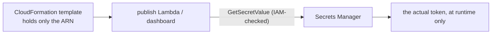

- **Benefit** — the secret value never appears in a template, an environment
  variable listing, or the repository. Anyone who can *describe* your
  infrastructure still cannot *read* your secrets; that needs a separate,
  narrowly-granted permission.
- **Tradeoffs** — each secret costs ~$0.40/month plus per-call fees; the value
  must be fetched at runtime, which adds a call (cached here) and a permission
  to manage. For non-secret configuration, plain environment variables are the
  right tool, and Telegator uses them for table names and queue URLs.
- **Traps**
  - **Pass the ARN, never the value.** The app stack's comment spells out why:
    an environment variable holding the session key would sit readable in the
    template, and that key can forge admin sessions.
  - **Scope the grant to one ARN.** `GetSecretValue` on `*` would let the
    dashboard read the bot token too. Each consumer here gets exactly one
    secret.
  - **`Secret.fromLookup` breaks the build.** Looking a secret up at synth
    time turns `cdk synth` into an authenticated call — forbidden in this
    repository. ARNs arrive as context parameters instead.

---

## 11. CDK and CloudFormation

**One-line meaning:** CloudFormation creates AWS resources from a JSON
description ("template") and can roll the whole set back as one unit; the CDK
lets you *write TypeScript that generates that template*. Status: **built** —
the whole `infra/` directory.

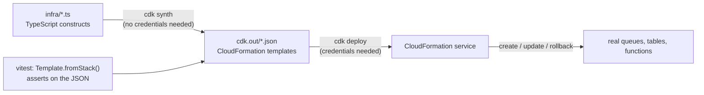

| Concept | One-line meaning |
| --- | --- |
| **Template** | The JSON description of resources CloudFormation executes |
| **Stack** | One deployed template; the unit of create, update and rollback — Telegator has five ([app.ts](../infra/lib/app.ts)), with a sixth planned |
| **Construct** | A reusable building block in CDK code; `new Queue(...)` is a construct |
| **L1 / L2** | Two construct levels: L1 (`CfnApp`) mirrors raw CloudFormation exactly; L2 (`Queue`, `Table`) adds good defaults and helper methods like `grantSendMessages` |
| **Synth** | Turning the TypeScript into templates; this project's fourth gate, and it must never need credentials |
| **Context** | `-c key=value` inputs read with `tryGetContext`; how deploy-time facts (image tags, callback URLs, secret ARNs) enter without lookups |
| **Cross-stack reference** | One stack using another's value; CDK writes the export/import wiring when you pass the construct object |
| **Assertions** | Tests over the synthesized JSON (`Template.fromStack`), e.g. "the publish role has no DeleteItem" |
| **Removal policy** | What happens to a resource when its stack is deleted: `DESTROY` or `RETAIN`; tables and the user pool are retained |
| **Rollback** | A failed create/update is undone automatically; a stack whose *first* create failed sits in `ROLLBACK_COMPLETE` and can only be deleted |
| **Drift** | The gap between the template and reality after manual console edits; checked with `cdk diff` / drift detection |

- **Benefit** — infrastructure is reviewed, tested and versioned like any
  other code. The L2 `grant*` helpers write correct IAM for you, and the
  assertion tests pin every hard-won decision so it cannot silently regress.
- **Tradeoffs** — L2 defaults are magic you must learn to read (`Queue` makes
  its own key decisions unless told); the tool adds its own vocabulary on top
  of AWS's; and a synthesized template can still fail at deploy, because synth
  checks shape, not service rules.
- **Traps** (each one cost this project real time)
  - **Synth validates less than you hope.** CloudWatch metric math, GSI update
    rules and account quotas are all checked by the *service at deploy time*.
    An invalid alarm expression passed all four gates and failed on deploy.
  - **L1 constructs accept unknown properties.** `iamServiceRole` vs
    `iamServiceRoleArn`: the wrong name compiled, synthesized, deployed — and
    the app ran with no role. Only `tsc` caught it. This is why the first gate
    is never skipped.
  - **`fromLookup` is a poisoned convenience.** Any context lookup makes synth
    call AWS with credentials, destroying the one credential-free gate. The
    repository bans it outright.
  - **`RETAIN` + a fixed name is a one-way street.** Delete the stack and the
    table survives — good — but a redeploy then fails because the name is
    taken. Recovering means importing or renaming, so back up before touching
    retained tables.
  - **`TableV2` is not "Table, newer".** It synthesizes a different resource
    type (`AWS::DynamoDB::GlobalTable`) with different settings layout. The
    code chose `Table` deliberately and says why.

---

## 12. CloudWatch — metrics, logs and alarms

**One-line meaning:** the shared place every AWS service reports numbers and
logs into, plus alarms that watch those numbers. Status: **built** —
[pipeline-stack.ts](../infra/lib/pipeline-stack.ts) (alarms),
`lib/metrics/` (writing), `lib/aws/observability.ts` (reading).

Remember the design decision from [section 2](#2-the-whole-system-in-one-picture):
posts in flight live in queues, not tables — so **CloudWatch is the only record
of how much work happened**. The metrics are load-bearing.

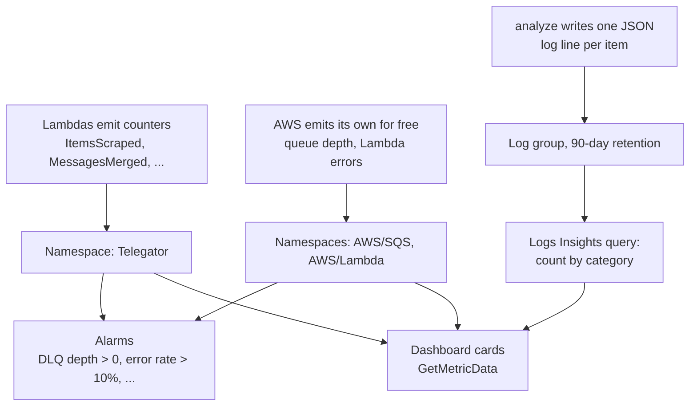

| Concept | One-line meaning |
| --- | --- |
| **Metric** | A named time series of numbers, e.g. `MessagesMerged` per minute |
| **Namespace** | The folder metrics live in; custom ones in `Telegator`, AWS's own in `AWS/Lambda`, `AWS/SQS` |
| **Dimension** | A label that splits a metric, e.g. `ItemsScraped` per `Source` |
| **Alarm** | A rule that fires when a metric crosses a threshold for long enough; five are declared here |
| **treatMissingData** | What an alarm does when there is *no* datapoint; here always `NOT_BREACHING` |
| **Metric math** | An expression over metrics, evaluated by CloudWatch — the error *rate* here is `100 * errors / invocations` |
| **Log group** | The container for one function's logs, with retention and access control |
| **Retention** | How long logs are kept; **the default is forever** (and billed forever); analyze is pinned to 90 days |
| **Structured logging** | Writing one JSON object per line so queries can address fields; see `lib/logging/logger.ts` |
| **Logs Insights** | A query language over log groups; the category chart is a query, not a metric |

- **Benefit** — every AWS service reports in without being asked; custom
  counters are two lines of code; alarms replace a human watching a screen.
- **Tradeoffs** — custom metrics are billed *per metric name and dimension
  combination*: the category chart would have cost 35 metrics for a chart
  nobody watches live, so it is a Logs Insights query instead — slower and
  paid per query, which is the right trade for rarely-viewed data. Metrics
  also arrive with a delay; this is monitoring, not tracing.
- **Traps**
  - **An empty queue reports nothing, not zero.** An alarm that treats missing
    data as breaching would ring forever on a *healthy* system.
    `TreatMissingData.NOT_BREACHING` on every alarm is that lesson, pinned.
  - **Metric math is parsed only at deploy.** `MAX([series, 1])` looks fine,
    synthesizes fine, and is rejected by the service. The working `IF(...)`
    form carries a comment telling the story.
  - **A log format change can silently blank a feature.** Lambda's
    `LoggingFormat.JSON` wraps each record in an envelope; the category query
    would match nothing, and the chart would be empty with no error anywhere.
    The code pins `TEXT` and explains.
  - **Log group names collide.** Declaring `/aws/lambda/<name>` yourself while
    CDK's managed-group feature also declares it fails the deploy; the code
    creates the group first and hands it to the function.

---

## 13. The hosting story: Amplify → App Runner → Fargate

Serving the Next.js dashboard is the one part of the design that changed twice,
and the reasons teach more AWS than any success story. Short version:

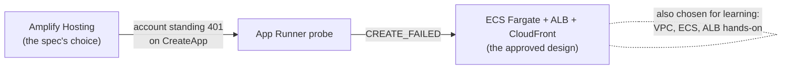

### 13.1 Amplify Hosting — built, and undeployable

**One-line meaning:** point Amplify at a git repository and it builds and
serves your web app, including Next.js server-side code, with no
infrastructure of your own. Status: **built** in
[app-stack.ts](../infra/lib/app-stack.ts) — and blocked: creating the app
returns a 401 tied to the account's billing standing. Correct template, correct
IAM, no workaround in code.

- **Benefit** — by far the least infrastructure: no VPC, no load balancer, no
  container; HTTPS and git-triggered builds included.
- **Tradeoffs** — the least control, and the platform decides how your
  framework runs; when the account itself is refused, there is nothing to fix.
- **Traps** (found before the block did its work)
  - `platform: "WEB_COMPUTE"` runs server code; `"WEB"` deploys a static
    export and every server action 404s. One string.
  - The `framework` field is **free text**. A misspelling of
    `"Next.js - SSR"` is accepted silently and the branch builds as a static
    site.
  - A branch resource takes the app's bare id (`attrAppId`); its `ref` is the
    ARN. The wrong one deploys and then fails to build.

### 13.2 App Runner — the probe that failed

**One-line meaning:** hand AWS a container image and get an autoscaling HTTPS
service, no cluster or load balancer to design. Status: **context** — probed
once as an escape from the Amplify block; the service ended `CREATE_FAILED` in
this account and the probe was deleted. It is the "easy mode" of what section
13.3 builds by hand, and worth knowing for accounts in good standing.

### 13.3 The Fargate design — planned

Everything below is **planned**, specified in
[2026-08-30-fargate-app-stack-design.md](superpowers/specs/2026-08-30-fargate-app-stack-design.md).
It was chosen partly *because* it is more manual: the operator wants to learn
VPC, ECS, ALB and PrivateLink directly.

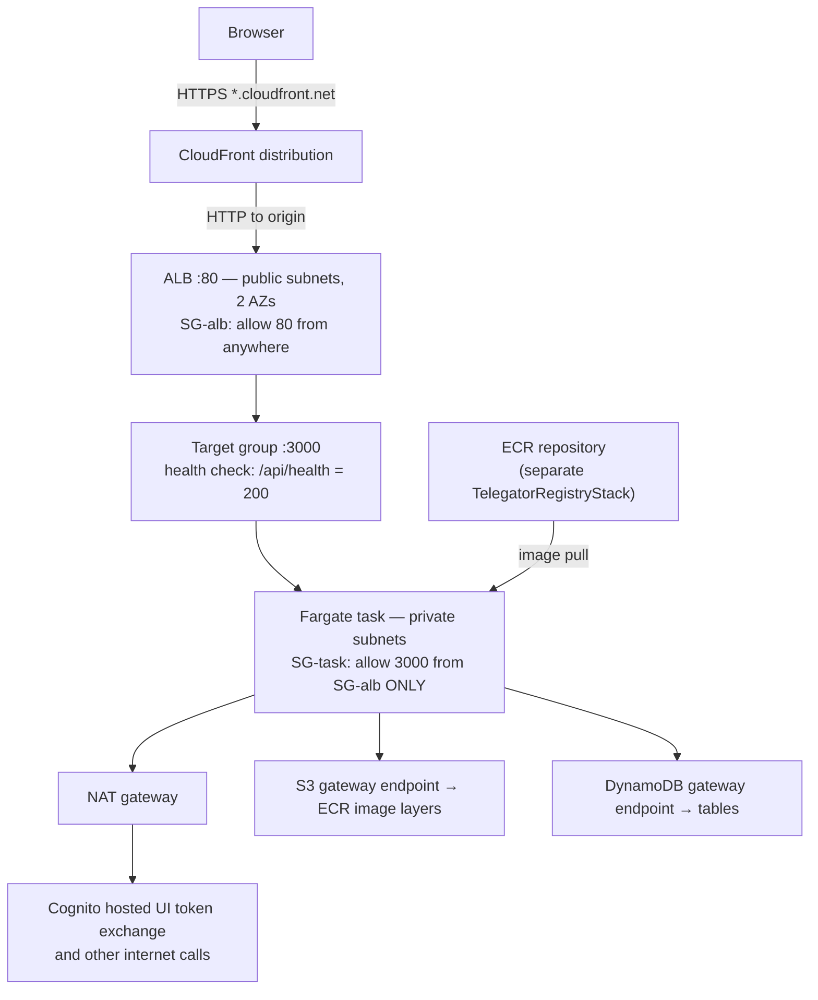

#### VPC and networking — planned

| Concept | One-line meaning |
| --- | --- |
| **VPC** | Your own private network inside a Region; nothing enters or leaves unless you build a door |
| **Subnet** | A slice of the VPC pinned to one Availability Zone; **public** (has a route to the internet gateway) or **private** |
| **Internet gateway** | The door that makes public subnets reachable from the internet |
| **NAT gateway** | A one-way door: private subnets can call out, nothing can call in; billed per hour *and* per GB |
| **Route table** | The rules deciding where a subnet's traffic goes |
| **Security group** | A stateful allow-list firewall on a network interface; reply traffic needs no rule |
| **VPC endpoint (gateway)** | A free private path to S3 or DynamoDB, so that traffic skips the NAT and its per-GB fee |
| **VPC endpoint (interface) / PrivateLink** | A paid (~$7.30/mo per AZ) private entrance to other AWS services |

- **Benefit** — the task has no public address at all; the *only* way in is
  through the load balancer, and a test asserts that wiring.
- **Tradeoffs** — the NAT gateway is ~$38/month, half the total bill; two AZs
  of subnets exist only because an ALB demands two, not for redundancy.
- **Traps**
  - **Coverage gaps decide the design.** There is *no* VPC endpoint for the
    Cognito hosted UI domain — so a fully "private" design would pass every
    gate and hang exactly at login token exchange. NAT is therefore mandatory,
    and eight interface endpoints (~$58/mo) would remove nothing. A test pins
    "zero interface endpoints" so a future cost review cannot silently break
    login.
  - **Security groups reference groups, not IP ranges.** "Port 3000 from
    SG-alb" keeps working when the ALB's addresses change; `0.0.0.0/0` there
    would undo the whole private design. This is the security-critical wire,
    and it is tested.

#### ECS, Fargate and ECR — planned

| Concept | One-line meaning |
| --- | --- |
| **ECS** | AWS's container orchestrator: you describe a task, it keeps N copies running |
| **Fargate** | The "no servers" way to run ECS tasks: AWS supplies the machines, you pay per vCPU-second and GB-second |
| **Cluster** | The namespace tasks run in |
| **Task definition** | The container spec: image, CPU/memory, environment, log driver, two roles |
| **Task role** | What *your application code* may call — carries the dashboard's whole permission set, unchanged from Amplify |
| **Execution role** | What the *ECS agent* uses: pull the image, write logs — and nothing else |
| **Service** | The controller keeping `desiredCount` (here: 1) tasks alive and registered with the load balancer |
| **ECR** | The private Docker image registry, with lifecycle rules to expire old images |

- **Benefit** — full control of the runtime (real container, any binary,
  any port) with no EC2 machine to patch; ARM64 halves nothing but shaves ~20%.
- **Tradeoffs** — always-on cost (~$16/mo for 0.5 vCPU / 1 GB) even at zero
  traffic — unlike everything else in this system; a Docker build step and an
  image registry now exist in the deploy story.
- **Traps**
  - **The two roles are not interchangeable.** Granting the app's permissions
    to the execution role is the classic ECS IAM bug: the agent gets your
    database and your code cannot pull its own image.
  - **The image must exist before the service.** A stack creating an empty ECR
    repository *and* a service pulling from it rolls back after a long
    timeout. Hence a separate `TelegatorRegistryStack`, deployed and populated
    first.
  - **Next.js standalone binds to loopback.** Without `HOSTNAME=0.0.0.0` the
    container looks healthy from inside and refuses every health check from
    outside.
  - **`fromAsset` would break the gates.** Building the Docker image during
    synth needs Docker and credentials; the design pins "no image asset in the
    template" with a test, and the image arrives as a tag via context.

#### ALB and CloudFront — planned

| Concept | One-line meaning |
| --- | --- |
| **Application Load Balancer (ALB)** | An HTTP-aware traffic distributor: listeners, rules, and health checks over a target group |
| **Target group** | The set of things traffic is forwarded to, plus the health check that decides who receives it |
| **Health check** | A URL the ALB polls; targets that fail are removed — and, under ECS, replaced |
| **CloudFront** | The CDN: terminates HTTPS at edge locations on a free `*.cloudfront.net` name and forwards to the origin |
| **Origin** | Where CloudFront fetches from — here, the ALB over plain HTTP |
| **ACM** | The certificate service; it can only issue for domains you *prove you control*, which an `*.elb.amazonaws.com` name never is |

- **Benefit** — CloudFront supplies the HTTPS that Cognito demands, on a
  domain nobody owns, for about $1/month; the ALB gives a stable front while
  tasks come and go.
- **Tradeoffs** — the ALB is ~$21/month at any traffic level; CloudFront's
  *defaults* are tuned for static sites and every one of them had to be turned
  off for a live dashboard (see traps).
- **Traps**
  - **The default health check kills everything.** It polls `/` expecting 200 —
    but every Telegator page requires login, so `/` answers 401. The target is
    "unhealthy", ECS replaces the task, forever, while all four gates stay
    green. The fix is a dedicated, unauthenticated `/api/health` route — which
    a test then pins as the *only* unauthenticated surface.
  - **Three CloudFront defaults break three features**: caching on would show
    stale queue depths (`CACHING_DISABLED`); GET/HEAD-only would 405 every
    server action, which are POSTs (`ALLOW_ALL`); and dropping cookies would
    sign everyone out on every click (`ALL_VIEWER` forwards them).
  - **Chicken-and-egg domains.** The CloudFront domain does not exist until
    the first deploy, but Cognito needs it as a callback URL — so the deploy is
    two-phase: deploy, read the domain back, redeploy Auth and App with it.

---

## 14. The wider AWS map — words you will meet elsewhere

Telegator uses a narrow slice of AWS. This section is the condensed version of
the wider map (adapted from the engx knowledge base, `engx/docs/07-cloud-aws/`),
so that names in blogs and interviews are not strangers. **Used** points back to
a section above; everything else is context.

### Compute — five ways to run code

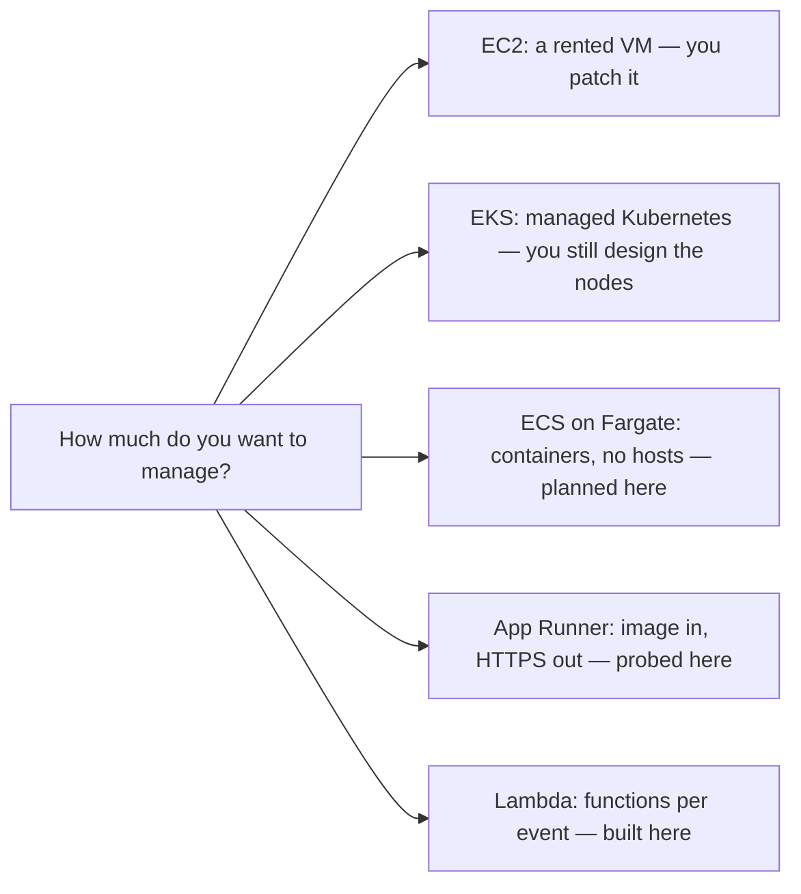

| Concept | One line | Here |
| --- | --- | --- |
| **EC2** | A rented virtual machine billed per second; you own patching and scaling | context |
| **Auto Scaling Group** | A fleet of EC2 held at a target size, replacing what fails | context |
| **EKS** | Managed upstream Kubernetes; AWS runs the control plane | context |
| **Graviton** | AWS's ARM processors; the reason Telegator's Lambdas and the planned Fargate task say ARM64 | used — §5, §13.3 |
| **Spot / Savings Plan** | Discounts for interruptible or committed workloads | context |

### Storage and data

| Concept | One line | Here |
| --- | --- | --- |
| **S3** | Object storage by key; very durable, no filesystem | mentioned — the planned gateway endpoint serves ECR layers from it, §13.3 |
| **EBS / EFS** | A block disk for one instance / a shared filesystem for many | context |
| **RDS / Aurora** | Managed relational databases; the road not taken — Telegator's data is key-value shaped, §7 | context |
| **ElastiCache** | Managed Redis/Memcached for repeated reads | context |
| **OpenSearch / Redshift / Athena** | Text search / warehouse analytics / SQL directly over S3 files | context |

### Messaging — beyond SQS

| Concept | One line | Here |
| --- | --- | --- |
| **SNS** | One message fanned out to many subscribers; SQS is one-to-one | context |
| **Kinesis / MSK** | Ordered, replayable streams (Kinesis native, MSK is managed Kafka) — readers keep a position instead of consuming | context |
| **Step Functions** | A state machine coordinating services with retries and waits as data | context — the queues *are* Telegator's state machine |
| **API Gateway** | A managed HTTP front door with auth and throttling | context — Next.js server actions play that role here |

### Operations, security, resilience

| Concept | One line | Here |
| --- | --- | --- |
| **CloudTrail** | The audit log of every API call in the account — who, when, allowed or denied | context |
| **AWS Config** | Configuration history of resources, judged against compliance rules | context |
| **X-Ray** | Tracing one request's path across services | context |
| **Systems Manager** | Fleet operations and a shell onto instances without SSH | context |
| **KMS** | Managed encryption keys that never leave the service; everything here uses AWS-owned keys implicitly | context |
| **WAF** | Rule-based request filtering at the edge | context |
| **Shared responsibility model** | AWS secures the cloud; you secure what you put in it — IAM policies, `selfSignUpEnabled: false`, secrets handling are all on *your* side of the line | idea used throughout |
| **RTO / RPO** | How long recovery may take / how much data it may lose; PITR on `messages` (§7) is an RPO decision | idea used — §7 |
| **Idempotency** | Repeating a request changes nothing more — what makes at-least-once delivery safe; Telegator's FIFO dedup ids and "edit in place" publishing are idempotency at work | idea used — §6 |
| **Exponential backoff with jitter** | Retrying after a growing, randomized delay so callers do not stampede | idea used — inside every AWS SDK client |

---

## 15. Traps this project actually hit

The most valuable table in this guide. Every row cost real time, and every row
is now pinned by a test or a comment so it cannot happen twice silently.

| # | Trap | The lesson | Where recorded |
| --- | --- | --- | --- |
| 1 | Bedrock calls 403'd with a "correct" role | The permission must name the service the client *actually signs for* (`bedrock-mantle:CreateInference`, not `bedrock:InvokeModel`) | `infra/lib/pipeline-stack.ts` `createInference()` |
| 2 | Bedrock refused above IAM | An AWS Organization can disable a whole service; no policy in the repo can help | memory notes; §9 |
| 3 | Amplify create returned 401 | Account standing beats correct templates; the design moved to Fargate | Fargate spec §1 |
| 4 | GSI projection change rejected at deploy | `cdk diff` predicts from the template only; DynamoDB refuses in-place projection edits — plan two deploys | `infra/lib/data-stack.ts` comment |
| 5 | Reserved concurrency uncreatable | A cold account's whole quota is 5; reserving any breaks stack creation — hence the `reserveConcurrency` flag | `infra/lib/config.ts` R40 |
| 6 | Alarm metric math failed only at deploy | Synth checks shape, the service checks meaning; `MAX([series, scalar])` is invalid | `infra/lib/pipeline-stack.ts` alarm comment |
| 7 | FIFO queue rejected its batching window | AWS constraint absent from the spec; CDK caught it at synth | `infra/lib/pipeline-stack.ts` R33 |
| 8 | Log group name collision on deploy | Create the group yourself and pass it in; two owners of one name cannot coexist | `infra/lib/pipeline-stack.ts` R41 |
| 9 | Wrong L1 property name accepted silently | `iamServiceRole` vs `iamServiceRoleArn` — only `tsc` caught an app running with no role | `infra/lib/app-stack.ts` comment |
| 10 | `AWS_REGION` cannot be declared | Lambda reserves it; CloudFormation rejects setting it — read it, never write it | `infra/lib/pipeline-stack.ts` environment comment |
| 11 | Retained tables blocked a redeploy | `RETAIN` + fixed `tableName` orphans tables on stack delete; back up before touching them | memory notes; §11 |
| 12 | Root user could not assume roles | Deploy as an IAM identity (`telegator-deploy`), never as root | memory notes |
| 13 | Health checks would crashloop the planned service | An all-authenticated app answers 401 on `/`; give the ALB its own unauthenticated route | Fargate spec §4.3 |
| 14 | A "fully private" VPC would break only login | No VPC endpoint exists for the Cognito hosted UI; NAT is mandatory | Fargate spec §4.2 |

Read the table twice and one pattern appears: **the four local gates verify
shape, and AWS verifies meaning at deploy time**. That is the deepest AWS
lesson in this repository — synth passing is the beginning of confidence, not
the end.

---

## 16. Where each concept lives — a file map

| You want to see... | Open |
| --- | --- |
| All five stacks assembled, in order | [infra/lib/app.ts](../infra/lib/app.ts) |
| Tables, GSIs, projections, PITR, RETAIN | [infra/lib/data-stack.ts](../infra/lib/data-stack.ts) |
| Queues, FIFO groups, DLQs, delays | [infra/lib/queue-stack.ts](../infra/lib/queue-stack.ts) |
| Lambdas, triggers, IAM grants, alarms | [infra/lib/pipeline-stack.ts](../infra/lib/pipeline-stack.ts) |
| Cognito pool, hosted UI, groups | [infra/lib/auth-stack.ts](../infra/lib/auth-stack.ts) |
| Amplify app and the dashboard role | [infra/lib/app-stack.ts](../infra/lib/app-stack.ts) |
| Narrow IAM as a habit | [infra/lib/grants.ts](../infra/lib/grants.ts) |
| The Bedrock client and model id | [lib/ai/bedrock.ts](../lib/ai/bedrock.ts), [lib/ai/constants.ts](../lib/ai/constants.ts) |
| OAuth token exchange and JWT checking | [lib/auth/cognito.ts](../lib/auth/cognito.ts) |
| Reading metrics, queue depth, Logs Insights | [lib/aws/observability.ts](../lib/aws/observability.ts) |
| Emitting custom metrics | [lib/metrics/cloudwatch.ts](../lib/metrics/cloudwatch.ts) |
| The Fargate future | [docs/superpowers/specs/2026-08-30-fargate-app-stack-design.md](superpowers/specs/2026-08-30-fargate-app-stack-design.md) |
| The full specification | [docs/telegator-design.md](telegator-design.md) |

**Further reading** in the engx knowledge base (`~/Projects/engx/docs/07-cloud-aws/`):
`03-aws-core-concepts.md` for the full one-line glossary of all of AWS,
`01-aws-stack-overview.md` for each service's entry point and classic trap, and
`02-aws-interview-prep.md` for the questions asked over all of it.
