# Telegator

An automated news pipeline on AWS, with a Next.js operator dashboard.

This is the project's only document. It has three parts, and they answer three
different questions:

| Part | Question it answers | Read it when |
| --- | --- | --- |
| **I — Specification** (§1–§11) | What must the system do? | Implementing, reviewing, or testing behaviour |
| **II — AWS explained** (§12–§24) | What are these services, and what do they cost you? | New to AWS, or new to this repository |
| **III — Record** (§25–§27) | Why is the code not exactly Part I? | A comment cites `R#`, or something surprises you |

**Part I is normative.** Code cites it by section and line (`§3.4 L316`), and
`test/specCitations.test.ts` fails if a citation stops resolving. Where the code
diverges from Part I, the divergence is a **reconciliation** with a number, and
§25 is the register of all of them.

Three status labels appear throughout:

| Label | Meaning |
| --- | --- |
| **built** | It exists in the code today. You can open the file. |
| **planned** | It is designed here but not built. |
| **context** | AWS offers it; Telegator does not use it. The word is here so it is not a stranger. |

---

# Part I — Specification

## 1. System Overview

### 1.1 Purpose

Telegator is an automated news pipeline. It collects unstructured posts from public Telegram channels, enriches each post with AI-generated structured metadata, groups posts that report the same story into a single message, and republishes those messages to target Telegram channels. An operator dashboard exposes pipeline state and allows manual intervention.

The product value is **deduplicated, categorised, translated news digests** — several channels reporting the same event become one published message that updates in place as more sources report it.

The system is Telegram-only. RSS ingestion is out of scope: it stays on the legacy system, or returns as new work.

### 1.2 Actors

| Actor | Role |
| --- | --- |
| **Operator** | Signs in to the dashboard. Curates sources, reviews and edits messages, replays failed work, watches pipeline health. |
| **Scheduler** | One EventBridge rule invoking the scraper every 30 minutes. The only scheduled component. |
| **Queues** | Carry work between the remaining stages. Provide retry, back-pressure and failure isolation. |
| **Telegram (source)** | Public channel web-preview pages, scraped anonymously without the Telegram API. |
| **AI provider** | Classifies content, and adjudicates ambiguous duplicate pairs. |
| **Telegram Bot API (sink)** | Receives published and edited messages on target channels. |

### 1.3 The central design idea: the queue is the pipeline

Its two jobs are now split:

- **Work-in-flight** is an SQS message. A scraped post travels as a queue payload and is never written to a table while in transit.
- **Durable record** is the `messages` table. A post becomes durable only at the moment it is absorbed into a message — and it is stored *inside* that message, not beside it.

Consequences that shape everything downstream:

1. Pipeline volume and health come from CloudWatch, not from a table scan (§8.5).
2. `publish` cannot look items up at send time, so `aggregate` must **denormalize** each item's renderable content into the message (§2.3).
3. A post that is scraped but never merged into a message — classified `skip`, or errored past its retries — leaves no row anywhere. It exists only in logs and the dead-letter queue.

### 1.4 The system in one picture

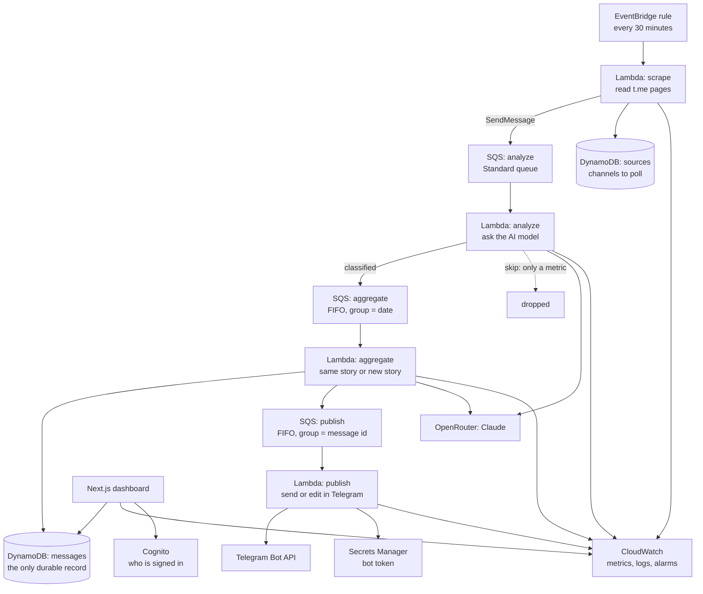

**scrape → analyse → aggregate → publish.** Posts are classified, deduplicated into stories, and published — each story as a single Telegram message that is edited in place as more sources report it.

The dashboard never calls pipeline code directly. It reads the same tables and may invoke two Lambdas by name; `test/boundaries.test.ts` enforces that wall (§8.2).

---

## 2. Domain Model

**Two tables.** `sources` (what to poll) and `messages` (what to publish). Everything in between is a queue payload.

### 2.1 `sources` — Telegram channels to poll *(table)*

| Field | Type | Written by | Meaning |
| --- | --- | --- | --- |
| `id` | string | operator/seed | Telegram channel username, e.g. `yigal_levin`. Also the scrape URL segment. |
| `status` | string | operator | `ok` enables polling. Any other value disables the source. |
| `tgChannel` | string | operator | **Target** channel this source's content publishes to. |
| `category` | string | operator | Default category stamped onto scraped posts. |
| `tags` | string | operator | Comma-separated tags stamped onto scraped posts. |
| `teaser` | string | operator | Boilerplate substring stripped from every scraped body. |
| `lastItemId` | string | scrape | Newest Telegram message id seen. The `?after=` cursor — **the sole duplicate-suppression mechanism** (§3.1). |
| `lastCount` | number | scrape | Post count from the last poll. Drives the refresh-rate heuristic. |
| `lastUpdated` | number | scrape | Epoch ms of last poll attempt. |
| `lastResult` | string | scrape | ISO timestamp of last successful poll. |
| `zeroYieldRuns` | number | scrape | Consecutive polls returning nothing. Drives the staleness alarm (§4.1). |
| `lastNonZeroCount` | number | scrape | The last poll that returned anything, kept when `lastCount` falls to 0 — §4.1's alarm needs "had a non-zero history" after the count itself has gone. |
| `deleted` | boolean | operator | Soft delete. A deleted source is neither polled nor listed. |

### 2.2 Item payload — the in-flight post *(SQS, not a table)*

An item is a queue message. Its shape changes as it moves down the pipeline.

**Stage A — `scrape` → analyze queue:**

| Field | Type | Meaning |
| --- | --- | --- |
| `id` | string | Composite `{sourceId}/{telegramMessageId}`. Stored verbatim; no encoding (§2.4). |
| `body` | string | Plain text with inline links replaced by `[text](#N)` tokens. |
| `links` | array | `[{id: number, href: string}]` resolving the `#N` tokens. |
| `image` | string | URL extracted from the post's `background-image` style. |
| `forwardedFrom` | string | Origin channel when the post is a forward. |
| `tgChannel` | string | Target publish channel, copied from the source. |
| `date` | string | `YYYY-MM-DD` — **the scrape date, not the post date.** Partitions deduplication *and* becomes the FIFO message group. |
| `category` | string | Source default; overwritten by AI. |
| `tags` | string | Source tags; merged with AI tags. |
| `kind` | enum | `post` \| `forward` \| `empty` — replaces the old initial `status` value. |

**Stage B — `analyze` → aggregate queue:** everything above, plus `title`, `summary`, `country` (uppercased), `location`, `importance`, `peoples`, `properNames`, and AI-merged `tags`.

Payloads are well under the **256 KB** SQS limit — Telegram caps a post at 4096 characters. If a payload ever exceeds it, fall back to the claim-check pattern (body to S3, key in the message); not expected, not built by default.

### 2.3 `messages` — aggregated, publishable stories *(table)*

The only durable record of a Telegram post.

| Field | Type | Written by | Meaning |
| --- | --- | --- | --- |
| `id` | string | aggregate | Id of the **first** item that created the message. |
| `status` | enum | aggregate/publish | `topublish` \| `published` \| `error` |
| `members` | **Map** | aggregate | `{itemId → MemberBlock}`. Replaces the source's comma-separated `items` string. |
| `memberCount` | number | aggregate | Cached `size(members)`, so the dashboard need not read the map. |
| `memberIds` | list | aggregate | The ids already in `members`, projected on `date-index` so replay is detected without a base-table read (§6.3). |
| `keyEntities`, `keyTitle`, `keyTags` | list | aggregate | The match key this message deduplicates on (§6.1). |
| `date` | string | aggregate | Copied from the item. Partitions the candidate search and the FIFO group. |
| `title`, `category`, `country`, `location`, `peoples`, `tags`, `image` | string | aggregate | Copied/merged from member items. |
| `tgChannel` | string | aggregate | Target channel; defaults to `telegator_news`. |
| `tgId` | string | publish | Telegram `message_id`. **Its presence turns the next publish into an edit.** |
| `tgAt` | number | publish | Epoch ms of last publish/edit. |
| `ts` | number | aggregate/publish | Last-write epoch ms. Sort key on the GSIs. |
| `deleted` | boolean | dashboard | Soft delete. A deleted message is neither a merge target nor a dashboard row, and publish acknowledges it without sending. |

**`MemberBlock`** — everything `publish` needs to render one item, captured at aggregation time:

```ts
type MemberBlock = {
  summary: string;   // Belarusian summary, with [text](#N) tokens intact
  links: Array<{ id: number; href: string }>;
  channel: string;   // source channel segment, for the @mention
  ts: number;        // when this member joined, for stable ordering
};
```

**Why a Map, and what it buys.** Three problems collapse into one solution:

1. **Publish has no item table to read.** The block travels with the message.
2. **Idempotency is free.** Re-processing a replayed item writes `members.{itemId}` with the same value — a no-op. No conditional expression, no seen-ids table.
3. **Substring collisions disappear structurally.** With keyed map entries there is no comma-joined string to substring-match, so item `abc/1` can never resolve as a member of a message containing `abc/12`.

**Size.** Capped at **20** members (publish renders 12). 20 × ~600 bytes ≈ 12 KB — far below the 400 KB item limit.

### 2.4 Identifier encoding

Ids are composite and contain `/`. Ids are used **verbatim** (`channel/12345`) everywhere — as SQS payload fields, as DynamoDB map keys (via `ExpressionAttributeNames` placeholders, which accept any characters), and as partition keys. No encode/decode layer exists.

---

## 3. Pipeline Stages

**Five Lambdas:** one scheduled scraper, three queue consumers, one manual replay handler. Every consumer reports **partial batch failures** so one bad message never forces a whole batch to retry.

### 3.1 Stage 1 — `scrape` · *EventBridge, every 30 min*

**Timeout:** 300 s. **Memory:** 512 MB. **Reserved concurrency:** 1.

**Selection.** Query `sources` by `status-index` for `status = "ok"`. Keep those where:

```
now - lastUpdated >= (lastCount > 0 ? 30 : 240) * 60_000
```

Take the first **10**. Three tiers: a **hot** source (>20 posts last run) is always eligible; a **warm** source (1–20) after 30 minutes; a **cold** source (0) backs off to 240 minutes.

**Fetch.** `GET https://t.me/s/{sourceId}`, appending `?after={lastItemId}` when a cursor exists. Browser-like headers (`User-Agent` Chrome/120 on macOS, `Accept-Language: en-US,en;q=0.9,ru;q=0.8,be;q=0.7`). Non-2xx yields an empty string, not an exception.

**Parse.** Split the HTML on the literal marker `<div class="tgme_widget_message_wrap js-widget_message_wrap">`, discarding the first fragment (page chrome). Each remaining chunk is one post:

| Field | Extraction rule |
| --- | --- |
| `id` | First `href="https://t.me/{any}/{digits}"` → capture the digits. |
| body (raw) | Inner HTML of `<div class="tgme_widget_message_text …">`. |
| `links` + tokenised body | Replace each `<a href="X">Y</a>` with `[Y](#N)`, N from 1; collect `{id: N, href: X}`. |
| `body` | Strip remaining tags; `<br>` → `\n`; decode `&amp; &lt; &gt; &quot; &#39; &nbsp;`; collapse 3+ whitespace to `\n\n`; trim. |
| `image` | First `background-image:url('X')` → X. |
| `forwardedFrom` | `tgme_widget_message_forwarded_from_name` anchor's channel segment. |

**Guards.** An empty fetch, no chunks, or a first chunk with no id increments `zeroYieldRuns` and sets `lastCount: 0`, `lastUpdated: now`. A successful parse resets `zeroYieldRuns` to 0.

**Duplicate suppression — cursor only.** There is no existence check; there is no table to check against. `lastItemId` is the sole mechanism, and the `members` map absorbs anything that slips past (§2.3) — but only within the same `date`, because candidates are drawn from `date-index` for that date alone.

**Transform.** Per post: `id = "{sourceId}/{messageId}"`; strip the source's `teaser` from the body; stamp `tgChannel`, `category`, `tags`, `date` = today; set `kind` to `forward` (if forwarded), `empty` (blank body) or `post`.

**Enqueue.** Posts with `kind === "post"` go to the **analyze** queue via `SendMessageBatch` (10 per call). `forward` and `empty` posts are **dropped** with a counter metric.

**Cursor update.** Cursor fields are written **only after** the enqueue succeeds. A failed enqueue leaves `lastItemId` unadvanced so the next run retries those posts.

**Acceptance criteria**

- AC-1.1 A source polled 5 minutes ago with `lastCount = 3` is not selected.
- AC-1.2 A source with `lastCount = 25` is selected regardless of `lastUpdated`.
- AC-1.3 A post containing two links produces `[…](#1)`, `[…](#2)` and a `links` array of length 2.
- AC-1.4 An unreachable source increments `zeroYieldRuns` and leaves other sources unaffected.
- AC-1.5 A failed `SendMessageBatch` leaves `lastItemId` unchanged.
- AC-1.6 A forwarded post is counted and dropped, never enqueued.

### 3.2 Stage 2 — `analyze` · *SQS Standard consumer*

**Batch size:** 10. **Batching window:** 60 s. **Timeout:** 300 s. **Visibility timeout:** 1800 s. **Reserved concurrency:** 5.

**Pre-filter.** A body that is empty, or is a bare link with no prose, is **dropped** with an `ItemsSkipped` metric — no AI call, no downstream message.

**AI call.** One request per item (§5.2).

**Routing.**

| Condition | Action |
| --- | --- |
| No category returned, or provider error | Throw → SQS retry → DLQ after 3 attempts |
| `importance === "low"` | **Drop**, metric `ItemsSkipped{reason=low}` |
| `category === "crime&law"` | **Drop**, metric `ItemsSkipped{reason=category}` |
| otherwise | Enqueue to **aggregate** (FIFO, `MessageGroupId = date`, `MessageDeduplicationId = itemId`) |

Also: `country` uppercased; AI `tags` merged with source tags (comma-split, deduplicated, comma-joined).

**Why errors throw rather than drop.** A provider error is transient; a `skip` decision is final. Throwing routes the item back through SQS retry and ultimately to the DLQ, where an operator can replay it.

**Acceptance criteria**

- AC-2.1 An item classified `importance: low` never reaches the aggregate queue.
- AC-2.2 A provider error on one message leaves the other nine in the batch successfully processed (partial batch failure reporting).
- AC-2.3 Source tags survive the merge alongside AI tags, with no duplicates.
- AC-2.4 `country` is always uppercase or empty.
- AC-2.5 An item failing three times lands in the analyze DLQ with its full payload intact.

### 3.3 Stage 3 — `aggregate` · *SQS FIFO consumer, `MessageGroupId = date`*

**Batch size:** 10. **Timeout:** 300 s. **Memory:** 1024 MB. **Visibility timeout:** 1800 s.

**Concurrency is controlled by the message group, not by a reserved-concurrency setting.** All items sharing a `date` form one FIFO group and are therefore processed strictly one batch at a time — exactly the serialisation deduplication needs. Different dates process in parallel, which makes a multi-day backfill fast without weakening same-day correctness.

**Matching** is specified normatively in §6.

**Merge (match found).** Update the matched message:

- `members.{itemId}` ← the item's `MemberBlock`. **Idempotent by construction**; an existing member keeps its original `ts`.
- `memberCount` ← recomputed; **stop adding members at 20**.
- match key ← **sorted union** of the message's key and the item's (§6.1).
- `image` ← keep existing if present, else take the item's.
- `tags` ← merged and deduplicated.
- `title`, `date`, `category`, `country`, `location`, `peoples` ← **overwritten** by the newest item's values.
- `status` ← `topublish`, unless the merge changes nothing a reader would see. `tgId` ← **preserved**.

**Create (no match).** New message: `id` = item id, `members` = `{itemId: block}`, match key = the item's, `status` = `topublish`, `tgChannel` = item's channel or `telegator_news`, plus the item's descriptive fields.

**Enqueue publish.** Send the message id to the **publish** queue with:

- `MessageGroupId = messageId` — serialises edits to the same Telegram message.
- `MessageDeduplicationId = messageId` — collapses repeat publish requests within the 5-minute dedup window.
- **Settle delay** — a story still accumulating members is published once after it settles rather than edited repeatedly. SQS FIFO supports only a queue-level delay, so it is configured on the queue (§7.3), not per message.

**The update-in-place contract.** Merging into an already-`published` message resets it to `topublish` while keeping `tgId`; Stage 4 then calls `editMessageText`. **A published story updates on Telegram as more sources report it.** Intentional; must be preserved.

**Acceptance criteria**

- AC-3.1 Two same-date items scoring at or above `MERGE_THRESHOLD` produce one message with two `members` entries.
- AC-3.2 Two matching items with *different* dates produce two messages.
- AC-3.3 Two items scoring at or below `DISTINCT_THRESHOLD` produce two messages.
- AC-3.4 Merging into a `published` message sets `topublish` and leaves `tgId` intact.
- AC-3.5 Items matched against each other within one batch merge without an intervening write.
- AC-3.6 A message's match key after merging equals the sorted union of the two inputs.
- AC-3.7 **Replaying the identical item message produces a byte-identical message record** — `members`, `memberCount` and `tags` are unchanged.
- AC-3.8 A 21st member is rejected; `memberCount` stays at 20.
- AC-3.9 Two items with the same `date` are never processed by two concurrent invocations.
- AC-3.10 A pair scoring inside the band is adjudicated, and the verdict decides.
- AC-3.11 A failing adjudication splits, and increments `DedupAdjudicationFailed`.
- AC-3.12 A verdict set that does not cover the requested pair ids exactly is an error.

### 3.4 Stage 4 — `publish` · *SQS FIFO consumer, `MessageGroupId = messageId`*

**Batch size:** 1. **Timeout:** 300 s. **Visibility timeout:** 1800 s.

Batch size is 1 deliberately: each send is rate-limited against Telegram, and the message group already serialises work per message.

**Load.** Read the message by id. If it is soft-deleted, or `status !== "topublish"`, acknowledge and exit — the work was superseded.

**Member rendering.** Take `members` entries sorted by `ts` ascending, first **12**. Per member:

1. In `summary`, replace each `[text](#N)` with `<a href="{href}">{text}</a>`, resolving N against that member's `links`. An unresolved token degrades to plain text.
2. Emit: `🔘 {content} - <a href="https://t.me/{itemId}">@{channel}</a>`

**Message assembly.**

```
<b>⚡️</b> <i>{date}</i> <b>{COUNTRY, location, category}</b>
                        ← blank line
{member block 1}
{member block 2}
…
                        ← blank line
{hashtag line}
```

Header location parts are the non-empty values of `country` (uppercased), `location`, `category`, joined with `", "`.

**Hashtag line.** Built from `category`, `location`, `peoples`, `tags`, every `title` word longer than 4 characters, `date_{YYYY-MM-DD}` and `ts_{epochMs}` — comma-split, trimmed, `none`/`null`/empty dropped, deduplicated, each mapped to `#hashtag` form (spaces and hyphens → `_`, `.,@!'"()` removed, lowercased), space-joined. It **is appended**, after the member blocks (§11.3).

**Overflow.** A message is capped at 4096 characters. Drop the hashtag line first, then reduce the number of rendered member blocks: hashtags are derived metadata and reconstructible from the record, whereas a member block is the only surviving rendering of a scraped post (§1.3).

**Send.**

- `tgId` empty → `sendMessage`, or `sendPhoto` when an image is present and the text fits.
- `tgId` present → `editMessageText`. Photos are never re-sent on an edit.
- Photo suppressed entirely when text exceeds 1012 characters.
- `parse_mode: html`. Link preview disabled when the message has a title or image.
- **≥3 s pause after each send**; one retry on `429` honouring `parameters.retry_after`.

**Result.** Success → `status: published`, `tgId`, `tgAt`, acknowledge. Failure → throw, so SQS retries and ultimately DLQs. `status: error` is written only after retries are exhausted, by the DLQ handler.

**Acceptance criteria**

- AC-4.1 A message with `tgId` triggers an edit, not a new post.
- AC-4.2 A message whose text exceeds 1012 characters is sent without a photo.
- AC-4.3 A member keyed `abc/1` never renders content belonging to `abc/12`.
- AC-4.4 A `[x](#3)` token with no matching link renders as `x`.
- AC-4.5 A message whose status is no longer `topublish` is acknowledged without a Telegram call.
- AC-4.6 Two publish requests for the same message id within 5 minutes result in **one** Telegram call.
- AC-4.7 A Telegram failure retries and eventually DLQs; it never silently drops.

### 3.5 DLQ replay handler

One Lambda, invoked manually from the dashboard, drains a named DLQ back onto its source queue with a replay counter. This is the operator's recovery path.

Because `aggregate` is idempotent (§2.3, §6.3) and `publish` checks status before sending, replay is safe at any time.

---

## 4. External Integrations

### 4.1 Telegram scraping (inbound)

Anonymous HTML scraping of `t.me/s/{channel}` — the public web preview. No API credentials, no published rate limits, no terms-of-service guarantee.

**This is the system's most fragile dependency.** The parser depends on four literal CSS class names. A Telegram markup change breaks ingestion silently: chunk splitting yields zero results, which the code reads as "no new posts."

**Required mitigation.** `zeroYieldRuns` on the source record (§2.1). When a source with `status: "ok"` and a non-zero historical `lastCount` reaches **3** consecutive zero-yield runs, emit a `SourceStale` metric and alarm. Silent zero-yield must be observable.

### 4.2 Telegram Bot API (outbound)

Base: `https://api.telegram.org/bot{token}`. Methods: `sendMessage`, `editMessageText`, `sendPhoto`.

- Chat id is the target channel with a leading `@`.
- Bot must be an administrator of every target channel.
- **Failures return HTTP 200 with `{ok: false, description}`** — status codes are not the error signal; check the `ok` field.
- Limits: 4096 chars per message, 1024 chars per photo caption, ~20 messages/minute per channel.

Pacing and retry are specified in §3.4.

---

## 5. AI Contract

### 5.1 Provider

**Decision: OpenRouter.** Both model calls go to Claude through OpenRouter's Anthropic-compatible Messages API. A bearer key in Secrets Manager replaces IAM.

```ts
import Anthropic from "@anthropic-ai/sdk";
const client = new Anthropic({ baseURL: "https://openrouter.ai/api", apiKey });
```

The base URL carries **no version segment**: the SDK appends `/v1/messages` itself, so `https://openrouter.ai/api/v1` produces a 404 that reads like an outage.

OpenRouter model ids carry a vendor slug prefix. The tier is **`anthropic/claude-haiku-4.5`**, held in one constant so the id the request carries is written once. Model choice is the operator's call: a different tier is a one-line change with no other specification impact.

Two stages call a model, and only two:

| Caller | Purpose |
| --- | --- |
| `analyze` | Classify each post: title, summary, category, country, importance (§5.2) |
| `aggregate` | Adjudicate ambiguous "same story?" pairs (§5.3) |

No embedding model is called anywhere. Deduplication is deterministic on the common path (§6).

### 5.2 Classification request

Structured outputs and adaptive effort both reach the Messages endpoint through `output_config`.

```ts
const response = await client.messages.create({
  model: CLASSIFIER_MODEL_ID,
  max_tokens: 2000,
  output_config: {
    effort: "low",                  // classification, not reasoning
    format: { type: "json_schema", schema: NEWS_ITEM_SCHEMA },
  },
  system: SYSTEM_PROMPT,
  messages: [{ role: "user", content: itemBody }],
});
```

**System prompt** (load-bearing — the `[text](#N)` preservation rule keeps link tokens intact for Stage 4):

```
You are all about analyzing the ongoing news articles, keeping strong focus on matters of facts.
Your responses MUST follow the rules:
- respond in JSON format! according responseSchema provided.
- preserve '[text](#[1-9]+)' tokens intact;
- no extra punctuation; no any emoji;
- keep neutral tone, avoid hate speech;
```

**Schema.** Required: `title`, `summary`, `country`, `location`, `importance`, `category`. Optional: `peoples`, `properNames`, `tags`.

| Field | Constraint | Description |
| --- | --- | --- |
| `title` | string | Essential subject in three words, English. |
| `summary` | string, **≤220 characters** | Brief factual matter — no implications, opinions or judgements. **In Belarusian.** |
| `country` | string | ISO-3166 alpha-2 code. |
| `location` | string | City or region, English. |
| `category` | enum | One of §5.4's values. |
| `importance` | enum | `high` \| `low`. "Diminish any of sports, criminal accidents, funny, temporary, and local content." |
| `peoples` | string | Comma-separated person names, Latin letters, English. |
| `properNames` | string | Comma-separated places, organisations, events, English. |
| `tags` | string | 3–5 related tags, English. |

The 220-character cap must be stated **in the field's description**, not only in the JSON schema: a schema-only `maxLength` is not honoured, and over-long summaries fail validation after the call has been paid for.

`temperature` and `top_p` are not carried over — they are removed on current Claude models and return 400. Depth is controlled by `output_config.effort`.

The English fields above are what makes §6 language-neutral: only `summary` (Belarusian) and `body` (Russian/Ukrainian) are not, and neither is used for matching.

### 5.3 Adjudication request

`aggregate` sends the ambiguous band (§6.2) to the same Messages API, in **one call per invocation** carrying at most 10 pairs.

```ts
export interface AdjudicationPair {
  readonly id: string;              // stable, caller-assigned
  readonly item: AdjudicationFields;
  readonly candidate: AdjudicationFields;
}

export interface Adjudicator {
  adjudicate(pairs: readonly AdjudicationPair[]): Promise<AdjudicationVerdicts>;
}
```

`AdjudicationFields` carries only the English structured fields — title, entities, tags, category, location, date. **Never `body`, never `summary`**: the call stays small and language-neutral.

**Verdicts are keyed by pair id and validated for exact coverage — never positional.** A model can return fewer answers than it was asked for, and a positional array would then attach every subsequent verdict to the wrong pair — a dedup fault with no error anywhere. A verdict set that does not cover the requested ids exactly is an error, not a partial result.

The response is constrained by a Zod-derived strict output schema, the way the classifier's is.

`ADJUDICATOR_MODEL_ID` defaults to `CLASSIFIER_MODEL_ID`'s value but is its own constant, so the two tasks can diverge.

### 5.4 Categories

The classifier's `category` enum, 29 values:

```
art&fashion    crime          culture&history   news-digest
economics&finance   education   energy          entertainment
sports         environmental  geopolitics       health
human-rights   infrastructure international     media
other          politics       real-estate       science
social         technology     internet          traditions
tourism        traffic        war               incidents
nature
```

The enum is what constrains model output, so a value missing from this list is a category the classifier cannot say — it falls into `other`, silently degrading the routing §3.2 depends on.

Note that §3.2's drop rule tests for `crime&law`, which is **not** in this list, so that rule can never fire (§25, R5).

---

## 6. Deduplication (normative)

Two items describe the same story, or they do not. The decision is deterministic wherever the evidence is clear, and a model resolves only the strip in between.

### 6.1 The match key

Each item and each message carries a **match key** of three sets, built from §5.2's English fields:

| Set | Built from |
| --- | --- |
| `entities` | `peoples` and `properNames`, split on commas |
| `titleTokens` | `title`, split on whitespace |
| `tags` | `tags`, split on commas |

**Canonical form.** Every set is lowercased, trimmed, punctuation-stripped, deduplicated and **sorted** at write time. Identical input therefore serialises to identical bytes — this is what makes AC-3.7 hold.

**Merge.** Sorted union, capped at `MATCH_KEY_CAP = 256` entries per set in lexical order. The cap is a **storage bound, not a signal filter**: 20 members contributing ~10 terms each is ~200, so it is not normally reached.

Stored as three String **Lists**, not String Sets: a set cannot be empty, and an item with no tags is legal.

### 6.2 The score and the band

```
score = w_e * J(entities) + w_t * J(titleTokens) + w_g * J(tags)
J(x, y) = |x ∩ y| / |x ∪ y|
```

The weights and both thresholds are in §31's table, which is the one place any tunable is written.

**`J(EMPTY, EMPTY) === 0`, never 1.** Two items that both lack entities have no evidence, not perfect agreement. The naive expression is `0/0`; any reading that treats it as equality auto-merges every sparse pair.

**Gate:** same `date`. This is a correctness rule, not an optimisation — it prevents an anniversary story or recurring topic from merging into a message published days earlier — and it is also the FIFO message group, so the two uses reinforce each other. Deliberately *not* gated on `category` or `country`: §5.2 permits two sources' classifications to differ, so gating there would force a false split on a real duplicate.

**Band:**

```
score >= MERGE_THRESHOLD     → merge      (no model call)
score <= DISTINCT_THRESHOLD  → separate   (no model call)
otherwise                    → adjudicate (§5.3)
```

Both thresholds are injected with defaults, so recalibration is configuration rather than a code edit. The defaults are **provisional placeholders** until §10.3's sweep runs, and the production gate refuses to synth until real values are recorded.

### 6.3 The algorithm

```
INPUT:  batch[] of item payloads from the aggregate FIFO queue   (max 10,
        all sharing one MessageGroupId, i.e. one date)

for item in batch:
    candidates := query(messages, date-index, date = item.date)   # projects
                                                                  # match key
                                                                  # + memberIds

    # Step 1 — replay short-circuit, by identity, before any scoring
    if any candidate has item.id in its memberIds:
        merge there; continue

    # Step 2 — score against messages already touched in this batch
    #          (a candidate touched here is skipped in step 3, so the
    #           batch's own fresher work is never overwritten by the
    #           stored copy)
    # Step 3 — score against the remaining stored candidates
    # Keep only the single highest-scoring candidate.

    band := classify(bestScore)          # §6.2
    if band == adjudicate: collect the pair

ONE adjudication call for the whole batch (<= 10 pairs)           # §5.3

for item in batch:
    if merged: emit an attribute-level merge          # members loaded from the
                                                      # base table, which is the
                                                      # only access returning them
    else:      emit a create, conditional on the id not existing

WRITE the emitted operations to the messages table
enqueue(publishQueue, each touched messageId,
        MessageGroupId = messageId, MessageDeduplicationId = messageId)
```

The stage is **pure**: it performs no table write and enqueues nothing itself. Both are left to its caller, which is what makes the whole of §6 testable with no AWS at all.

**Why replay is exactly idempotent.** The step-1 short-circuit settles a replayed item by identity, before anything is scored — so it merges into the record it already belongs to, regardless of how that record's descriptive fields have since been overwritten. Union is commutative and idempotent, and an existing member keeps its original `ts`, so a replayed merge writes the same bytes as the original.

**Failure defaults to split.** An adjudication that throws, times out, or refuses yields *distinct*, and increments `DedupAdjudicationFailed`. **False merges are worse than false splits**: a false split is a duplicate post, whereas a false merge fuses two unrelated stories under one Telegram message that then keeps editing itself.

### 6.4 Known limitation: the sweep measures a different distribution from runtime

The calibration harness scores one item's key against another item's key. The pipeline scores an item's key against a **message's** key, and a message's key is the union accumulated over up to 20 members.

Those are not the same distribution, and the direction of the difference is known. Jaccard's denominator is `|a ∪ b|`, which grows with every absorbed member while the numerator counts only what this one item shares. So a genuine duplicate scores progressively lower against a story that has already absorbed several members: at three or four members a true match can drop below `DISTINCT_THRESHOLD` and be auto-split into a second message — the very duplicate the stage exists to prevent.

The sweep **structurally cannot** detect this: a labelled pair is two items, and there is no union key anywhere in the harness. Thresholds fitted there are fitted to the easier of the two distributions.

This is recorded, not fixed. Correcting it means changing the rule — a containment or coverage measure in place of symmetric Jaccard against the union, or scoring against members individually — and that is a design decision, not a calibration one. Until the labelled set carries item-versus-merged-key pairs at a couple of group sizes, the recorded auto-split recall should be read as an **upper bound** on the multi-member case.

---

## 7. AWS Architecture

### 7.1 Component map

| Concern | Source (Firebase) | Target (AWS) |
| --- | --- | --- |
| Work in flight | `items` table + `status` column | **SQS** (3 queues + 3 DLQs) |
| Durable records | 4 Firestore collections | DynamoDB (**2 tables**) |
| Duplicate detection | Firestore `findNearest` | Date-partitioned query + in-memory scoring (§6) |
| Scraper | Cloud Scheduler + Functions | EventBridge rule + Lambda |
| Stage execution | Scheduled polling | SQS event source mappings |
| HTTP API | `onRequest` handler | Next.js server actions |
| Auth | Firebase Auth | Amazon Cognito |
| Secrets | Firebase secrets | Secrets Manager (Telegram + OpenRouter) |
| AI | Gemini REST | OpenRouter (Claude, Messages API) |
| Hosting | Firebase Hosting | §9.3 |
| Pipeline metrics | Table scans in the browser | CloudWatch metrics + Logs Insights |

### 7.2 DynamoDB design

**Two tables**, both `PAY_PER_REQUEST`. Nothing is co-queried across them, so single-table modelling would add ceremony with no payoff.

| Table | PK | GSIs |
| --- | --- | --- |
| `telegator-sources` | `id` (S) | `status-index`: PK `status` — drives scrape selection |
| `telegator-messages` | `id` (S) | `status-index`: PK `status`, SK `ts` — publish backlog, dashboard listing, counts<br>`date-index`: PK `date`, SK `ts` — **the deduplication index** |

**GSI projections.** `status-index` on `messages` uses `INCLUDE` with dashboard-visible attributes only, **excluding `members`** — the one large attribute. `date-index` projects the three match-key lists plus `memberIds` and `deleted`, and nothing else: that is the whole input §6 needs, at a few hundred bytes per candidate. Nothing projects `members`, so publish and any member-level merge read the base table.

**A GSI's projection cannot be changed in place.** `cdk diff` renders such a change as a harmless in-place `[~]` because a diff is computed from the template and cannot predict what the service accepts; DynamoDB's `UpdateTable` then refuses it. Nor is there a fallback — `tableName` is fixed and `removalPolicy` is `RETAIN`, so a table replacement fails outright on the existing name. Changing a projection on an environment where the index already exists is **two deploys**: one with the index definition removed, waiting for the delete; one with it restored and the new projection in place, waiting for the backfill. Between the two, `aggregate` has no candidate query, so every item creates its own message and same-story items in that window are not deduplicated. Choosing when to spend that window is an operator's call. A brand-new environment creates the index once and is unaffected.

**Required alarm.** Emit `DedupCandidateCount` per aggregate run. Alarm at **> 500** — the point at which the in-memory comparison assumption needs revisiting. The migration path is a `date#shard` key or a dedicated index; documented now so it is not a surprise.

### 7.3 SQS design

| Queue | Type | Producer | Consumer | Key settings |
| --- | --- | --- | --- | --- |
| `telegator-analyze` | **Standard** | scrape | analyze | `batchSize 10`, window 60 s, visibility 1800 s, `maxReceiveCount 3` |
| `telegator-aggregate` | **FIFO** | analyze | aggregate | `MessageGroupId = date`, `MessageDeduplicationId = itemId`, `batchSize 10`, visibility 1800 s, `maxReceiveCount 3` |
| `telegator-publish` | **FIFO** | aggregate | publish | `MessageGroupId = messageId`, `MessageDeduplicationId = messageId`, `batchSize 1`, `DelaySeconds 300`, visibility 1800 s, `maxReceiveCount 5` |

Each has a matching DLQ, which for a FIFO queue must itself be FIFO. **Message retention: 14 days** (the SQS maximum) on every queue and DLQ.

**Why the types differ.**

- `analyze` is embarrassingly parallel — no item depends on another. Standard maximises throughput.
- `aggregate` must not run concurrently over the same day's items, or two invocations would each miss the other's write and create duplicate messages. FIFO with `MessageGroupId = date` serialises exactly that scope while letting different dates proceed in parallel. This replaces a blunt reserved-concurrency-of-1.
- `publish` must not edit the same Telegram message twice at once. `MessageGroupId = messageId` serialises per message; `MessageDeduplicationId = messageId` collapses repeat requests inside the 5-minute window; `DelaySeconds` lets a story settle before its first send.

**AWS does not support a batching window on a FIFO queue.** The aggregate queue therefore has `batchSize` alone. Deduplication survives it: candidates are queried from `date-index`, so correctness never depended on items arriving together.

**Content-based deduplication is off**, deliberately. Hashing the body would collapse two genuinely different posts that happen to share text; an explicit id is used instead.

**Visibility timeout is 6× the function timeout**, per AWS guidance, so a slow invocation cannot cause redelivery to a second worker.

**Partial batch failures.** Every consumer sets `functionResponseTypes: ["ReportBatchItemFailures"]` and returns the failed message ids. Without this, one poison message forces the whole batch to retry — which for `analyze` means re-billing nine successful model calls.

**FIFO throughput.** 300 messages/s without batching, 3,000 with. Volumes here are orders of magnitude below that.

### 7.4 Why queues rather than scheduled status polling

| Property | Scheduled polling | SQS |
| --- | --- | --- |
| End-to-end latency | Up to 4 hours (schedule-bound) | Seconds to minutes |
| Retry | Hand-rolled via `status: error`; nothing re-reads it | Native, with backoff and `maxReceiveCount` |
| Failure isolation | One bad row can abort a batch | Partial batch failure reporting |
| Poison messages | Stuck as `error` rows forever | DLQ, inspectable and replayable |
| Back-pressure | None — fixed batch every N minutes | Queue depth is the signal |
| Cost at idle | Every schedule fires and scans regardless | No messages, no invocations |

FIFO message groups also give **finer** concurrency control than reserved concurrency: serialised per date, parallel across dates.

The scraper stays on a schedule because nothing can push to us — Telegram must be polled. The result is **scheduled at the edge, event-driven internally**.

### 7.5 Lambda inventory

All Node.js 22, ARM64, bundled with esbuild.

| Function | Trigger | Timeout | Memory | Concurrency |
| --- | --- | --- | --- | --- |
| `telegator-scrape` | EventBridge `rate(30 minutes)` | 300 s | 512 MB | 1 (reserved) |
| `telegator-analyze` | SQS `telegator-analyze` | 300 s | 512 MB | 5 (reserved) |
| `telegator-aggregate` | SQS `telegator-aggregate` (FIFO) | 300 s | 1024 MB | by message group |
| `telegator-publish` | SQS `telegator-publish` (FIFO) | 300 s | 512 MB | by message group |
| `telegator-dlq-replay` | Manual (dashboard) | 300 s | 512 MB | 1 (reserved) |

Reserved concurrency is creatable only while the account keeps 5 concurrent executions unreserved, and a cold account's *entire* quota is 5 — so on an unraised account every reservation is rejected and the stack cannot be created at all. It is therefore behind a flag.

### 7.6 Secrets and IAM

| Secret | Store | Consumers |
| --- | --- | --- |
| `telegator/telegram-bot-token` | Secrets Manager | `publish` |
| `telegator/openrouter-api-key` | Secrets Manager | `analyze`, `aggregate` |
| session-cookie key | Secrets Manager | dashboard |

Per-function least privilege:

- `scrape` → read/write `sources`; `sqs:SendMessage` on the analyze queue
- `analyze` → consume the analyze queue; `sqs:SendMessage` on aggregate; `secretsmanager:GetSecretValue` on the OpenRouter key ARN
- `aggregate` → consume the aggregate queue; read/write `messages`; `sqs:SendMessage` on publish; `secretsmanager:GetSecretValue` on the OpenRouter key ARN
- `publish` → consume the publish queue; `GetItem`/`UpdateItem` on `messages`; `secretsmanager:GetSecretValue` on the bot-token ARN
- `dlq-replay` → receive on all DLQs, send on all source queues
- Dashboard role → read both tables, write `sources`/`messages`, `cloudwatch:GetMetricData`, `cloudwatch:PutMetricData` (namespace-conditioned), `logs:StartQuery`, `sqs:GetQueueAttributes`, `lambda:InvokeFunction` on the scraper and the replay handler, `cognito-idp:AdminGetUser`

"Read/write" is a description, not a grant: a stage that never deletes does not get `DeleteItem`. And a `Query` against an index authorises against the **index ARN**, not the table's — a grant on the table alone passes every test and fails at runtime.

**No model-inference grant exists.** With OpenRouter the only AWS-side statement is the *read of the token*; nothing in IAM can pin which model is called. The single model-id constant (§5.1) is the whole guard.

### 7.7 Observability

Because there is no items table, **CloudWatch is the pipeline's system of record for volume**. This is a deliberate trade, and it makes the metric set load-bearing rather than decorative.

**Counters** (custom metrics, namespace `Telegator`):

| Metric | Dimensions | Emitted by |
| --- | --- | --- |
| `ItemsScraped` | `Source` | scrape |
| `ItemsDropped` | `Reason` = `forward`\|`empty` | scrape |
| `ItemsAnalyzed` | — | analyze |
| `ItemsSkipped` | `Reason` = `low`\|`category`\|`nobody` | analyze |
| `MessagesCreated`, `MessagesMerged` | — | aggregate |
| `MessagesPublished`, `MessagesEdited` | — | publish |
| `DedupCandidateCount`, `MemberCapReached` | — | aggregate |
| `DedupAdjudicated`, `DedupAdjudicationFailed` | — | aggregate |
| `TelegramApiErrors` | `Method` | publish |
| `SourceStale` | `Source` | scrape |

**Category distribution** is *not* a custom metric. Custom metrics are billed per name-and-dimension combination, so 29 category dimensions would create 29 billable metrics for a chart nobody watches minute-to-minute. It comes instead from a **CloudWatch Logs Insights** query over `analyze`'s structured logs, run on demand and cached 60 s by the dashboard.

**The structured-log contract.** The category chart is a Logs Insights query, so the log *shape* is an interface and not a convenience:

- `analyze` writes one JSON object per line per classified item, carrying at least `msg: "item classified"` and `category`.
- The query is `filter msg = "item classified" | stats count() as count by category`.
- The Lambda log format must stay **`TEXT`**. `LoggingFormat.JSON` wraps each record in an envelope, after which the query matches nothing and the chart is empty with no error anywhere.
- Retention is §11.5's 90 days, applied to the group the function actually writes to.

Both literals are shared constants, because the emitter and the query are in layers that may not import each other.

**Queue depth** (`ApproximateNumberOfMessagesVisible`) is the modern equivalent of "count of items with `status = fetched`", and the dashboard surfaces it per queue.

**Alarms:** any DLQ depth > 0; `SourceStale`; `DedupCandidateCount` > 500; Lambda error rate > 10% over 15 minutes; `telegator-analyze` queue age > 1 hour. Every alarm treats missing data as **not breaching** — an idle queue reports nothing rather than zero, and the opposite setting would ring forever on a healthy system.

`SourceStale` is emitted **undimensioned as well as per source**: a CloudWatch alarm cannot enumerate a runtime-discovered dimension at synth time, and context lookups are banned (§22), so the alarm watches the undimensioned series.

---

## 8. Dashboard

### 8.1 Architecture decision

**Server-rendered. The offline-first layer is deleted.**

The source dashboard maintained an IndexedDB mirror of all seven collections, filled by a delta-sync protocol with a per-collection `ts` watermark. For an internal operator dashboard over a small dataset, App Router server components querying DynamoDB per request give the same UX with none of that machinery.

**Removed:** IndexedDB schema and stores, the `downstream`/`since` protocol, `upsertBatch` reconciliation, soft-delete tombstone propagation, `resetDb`, and the client cache-invalidation surface.

**Cost:** filtering and sorting become server round-trips. At these volumes it is not perceptible.

### 8.2 Route tree

```
app/
  layout.tsx                      Shell, nav, Cognito session provider
  page.tsx                        Dashboard — pipeline health
  sources/page.tsx
  messages/page.tsx               ?status=topublish
  queues/page.tsx                 Queue depths + DLQ inspection/replay
  api/auth/[...cognito]/route.ts  Cognito callbacks
lib/
  db/                             DynamoDB clients — sources.ts, messages.ts
  queues/                         SQS producers and payload schemas (Zod)
  pipeline/                       Stage implementations
  telegram/                       Bot client, HTML parser
  ai/                             OpenRouter classification and adjudication
  dedup/                          Match key, score, batch algorithm
actions/                          Server actions (§8.4)
```

**`lib/pipeline/` holds the single implementation of every stage.** The Lambda handlers are thin wrappers around it, built from this same repository. The dashboard does **not** import it — manual triggers call `lambda:InvokeFunction` on the deployed function, so "run this now" executes the exact deployed artefact.

`test/boundaries.test.ts` checks this over the **transitive** closure of `app/` and `actions/`, along with `aws-cdk-lib`. A constant needed by both layers moves to a module neither owns.

### 8.3 Pages

| Page | Content |
| --- | --- |
| **Dashboard** | Stat cards (items scraped / analysed / skipped 24 h, messages published), status and category charts from CloudWatch, queue-depth strip, 10 most recent messages |
| **Sources** | Table of id, status, tgChannel, category, `teaser`, lastCount, lastResult, `zeroYieldRuns`; inline edit; add; delete; export; **Scrape now** trigger |
| **Messages** | Status tabs; table of id, title, category, status, date, tgChannel, `memberCount`, with an expandable member list; inline edit; **Re-publish**; **Publish now** on the `topublish` tab; delete selected; export |
| **Queues** | Per-queue depth, DLQ inspection, replay |

Every table offers a keyword search across visible columns, per-column filters ANDed together, and column sort. Sorting is numeric-aware for numeric columns and locale-aware for strings — the content is Dutch and Russian as well as English. When filters narrow the result to nothing, the empty state renders *inside* the table so the controls stay reachable.

The expandable member list is a per-row base-table `GetItem`, because no index projects `members`. Rendering it from the list query instead would fail silently — the map is simply absent, so every row would expand to nothing.

### 8.4 Server actions

| Action | Signature | Authorisation |
| --- | --- | --- |
| `upsertRecord` | `(table, id, delta) => void` | `editor` |
| `deleteRecords` | `(table, ids[]) => void` | `editor` — soft delete, sets `deleted: true` |
| `loadMembers` | `(messageId) => MemberRow[]` | `viewer` |
| `exportTable` | `(table) => string` | `viewer` |
| `inspectDlq` | `(queueName) => DlqMessage[]` | `admin` |
| `runScraper` | `() => {processed}` | `admin` — invokes the scraper Lambda |
| `republishMessage` | `(messageId) => void` | `admin` — sets `topublish`, enqueues |
| `publishPending` | `(max) => {published, failed}` | `admin` — drains the `topublish` backlog, capped server-side |
| `replayDlq` | `(queueName, max) => {replayed}` | `admin` — invokes the replay handler |

Deletes are **soft**. Every action validates input with Zod and re-checks the caller's role server-side.

### 8.5 Dashboard computations

| Card / chart | Source | Window |
| --- | --- | --- |
| Items scraped | CloudWatch `ItemsScraped` Sum | 24 h |
| Items analysed | CloudWatch `ItemsAnalyzed` Sum | 24 h |
| Items skipped | CloudWatch `ItemsSkipped` Sum by `Reason` | 24 h |
| Messages published | DynamoDB count on `status-index` (`published`) | all |
| Errors | Sum of all DLQ depths | current |
| Status chart | Queue depths + message status counts | current |
| Category chart | Logs Insights over `analyze` logs | 7 d |
| Recent messages | `messages` `status-index`, `ts` descending, first 10 | — |

All CloudWatch reads are cached 60 s so a refresh does not re-query. The cache decorates the ports rather than wrapping each card, so the rule holds for reads added later.

The pie charts keep the source's hand-built SVG arc geometry (centre 100,100, radius 80, `M cx cy L … A r r 0 large 1 … Z`, with the full-circle special case) and its 10-colour palette. No charting library is needed for two pie charts.

### 8.6 Authentication and authorisation

**Amazon Cognito user pool**, hosted UI, one group per role.

| Role | Grants |
| --- | --- |
| `viewer` | Read all pages, export |
| `editor` | + inline edit, add, delete |
| `admin` | + manual triggers, DLQ replay, re-publish, publish-now |

**Every `app/**/page.tsx` calls `requireRole("viewer", …)`** — pinned by `test/pageAuth.test.ts`.

Roles are **ordered**, `viewer` < `editor` < `admin`, and one array is the single source of that order: the Cognito group precedences, the `RoleSchema` enum and every `requireRole` comparison are all derived from it, so they cannot drift. Cognito precedence counts the other way — lower is more privileged — so the number is computed, never written by hand.

**The sign-in flow.** One catch-all route, `app/api/auth/[...cognito]/route.ts`, serves exactly three segments:

| Segment | Does |
| --- | --- |
| `login` | Generates a random `state`, stores it in a short-lived cookie, redirects to the hosted UI |
| `callback` | Compares the returned `state` to the cookie, exchanges the code for tokens, verifies the ID token against Cognito's JWKS, reads the group list, opens a session |
| `logout` | Clears the session cookie and redirects to the hosted UI's logout endpoint |

Two cookies, both `httpOnly`, `secure`, `sameSite=lax`, path `/`:

| Cookie | Lifetime |
| --- | --- |
| `telegator_oauth_state` | 600 s — long enough for a sign-in, short enough that a stale attempt is refused rather than replayed |
| `telegator_session` | Exactly as long as the ID token it was opened from |

The session is a **sealed** payload, not a bearer copy of the ID token, keyed by a 32-byte secret held in Secrets Manager and fetched at runtime (§7.6). Expiry is re-checked on read rather than trusted to the cookie's own `maxAge`, because a client controls what it sends back.

**A refused sign-in renders a page, not a bare 400.** It is the likeliest thing in the flow to go wrong — a sign-in that pauses longer than the state TTL arrives with nothing to match — and the page must contain **fixed strings only**: `state` and `code` are attacker-supplied, so echoing either would put reflected XSS on the operator console's own origin. Every refusal renders the same page, so a prober learns nothing about which check rejected it.

Ported rules: a new user is created **disabled** with no roles and must be enabled manually; a disabled user is rejected at every action, which needs a live read of one field.

**Not ported — deliberately.** The source's API handler bypassed authentication entirely when an emulator environment variable was set, granting `admin` with a synthetic uid. Local development uses a real Cognito dev pool. No code path skips authorisation.

---

## 9. Deployment

### 9.1 Stacks (AWS CDK, TypeScript)

| Stack | Contents | Status |
| --- | --- | --- |
| `TelegatorDataStack` | 2 DynamoDB tables + GSIs, PITR on `messages` | built |
| `TelegatorQueueStack` | 3 queues + 3 DLQs, redrive policies | built |
| `TelegatorAuthStack` | Cognito user pool, groups, app client | built |
| `TelegatorPipelineStack` | 5 Lambdas, 1 EventBridge rule, 3 event source mappings, IAM roles, log groups, alarms | built |
| `TelegatorAppStack` | Serves the dashboard — see §9.3 | built (Amplify), blocked |
| `TelegatorRegistryStack` | ECR repository with a lifecycle rule | planned (§9.3) |

Order: `Data`, `Queue`, `Auth` → `Pipeline` → `App`.

Deploy with `npm run deploy`, never a bare `cdk deploy`: a bare one omits the two secret ARNs, and the pipeline stack falls back rather than failing — so the stack creates cleanly and `publish` and `analyze` fail on their first message instead. The script resolves both ARNs by name, refuses to run as the account root (which cannot assume the bootstrap roles), and **diffs by default**; `--execute` is the opt-in.

### 9.2 Environments

`dev` and `prod`, isolated by AWS account. Resource names are `telegator-{env}-{resource}`, so a name in a console or a log says which environment made it.

**The EventBridge schedule defaults to disabled in both environments.** §9.5 step 4 deploys prod disabled and enables it only at step 6, after a 48-hour soak — so a flag derived from the environment name would start posting on day one. A deploy opts in with `-c scheduleEnabled=true`.

### 9.3 Hosting

The dashboard's hosting is the one part of the design that changed twice.

| Stage | Status | Outcome |
| --- | --- | --- |
| **Amplify Hosting** | built, undeployable | `CreateApp` returns 401 — "please open a Billing Support Case". `amplify:ListApps` succeeds and the deploy identity holds AdministratorAccess, so this is **account standing**, not IAM and not the template. Nothing in this repository can work around it. |
| **App Runner** | probed, rejected | `CreateService` was accepted; the service settled at `CREATE_FAILED`. Not a demonstrated escape either. The probe resources were deleted. |
| **ECS Fargate + ALB + CloudFront** | **planned** | The approved design, below. |

Fargate was chosen partly *because* it is more manual: the operator wants to work with VPC, ECS, ALB and PrivateLink directly. Construct-level choices are made for legibility, not for the shortest path to a running service — `ecs-patterns.ApplicationLoadBalancedFargateService` is rejected because it hides the VPC, security groups, target group and health check, which are the parts to be learned and the parts most likely to misbehave.

**The planned topology:**

```
Internet
   │  HTTPS  (*.cloudfront.net)
   ▼
CloudFront distribution
   │  HTTP   (origin: ALB DNS)
   ▼
ALB :80 ────────────── public subnets, 2 AZs
   │                    SG-alb: ingress 80 from 0.0.0.0/0
   ▼
Target group :3000     health check: /api/health = 200
   │
   ▼
Fargate task ───────── private-with-egress subnets
                        SG-task: ingress 3000 from SG-alb ONLY
   │
   ├── NAT gateway ──► Cognito hosted UI /oauth2/token, Secrets Manager,
   │                   SQS, Lambda, CloudWatch, cognito-idp
   ├── S3 gateway endpoint ──────► ECR image layers
   └── DynamoDB gateway endpoint ► sources, messages
```

**Four findings constrain it, and each is pinned by a test:**

1. **Cognito requires HTTPS callbacks**, with `http://localhost` as the only exception. An ALB serves HTTP on `*.elb.amazonaws.com` and cannot obtain an ACM certificate, because ACM issues only for domains whose control can be proven. CloudFront supplies HTTPS on its own domain at no cost — so it is not optional decoration; without it no login can complete.
2. **PrivateLink cannot reach the Cognito hosted UI.** Of the 393 endpoint services in `eu-central-1`, the only two matching Cognito are `cognito-identity` and `cognito-idp`; there is **no endpoint for the hosted-UI domain**. A fully private task would reach every AWS API it needs and still hang at the token exchange, with all four gates green. **A NAT gateway is therefore mandatory, not a cost choice**, and eight interface endpoints (~$58/mo) would remove nothing. A test pins "zero interface endpoints" so a later cost review cannot silently break login.
3. **The default ALB health check kills every task.** It polls `/` expecting 200, but every page requires login, so `/` answers 401 or a redirect. The target is unhealthy, ECS replaces the task, and the service crashloops forever while `cdk synth` stays green. Resolved by a dedicated unauthenticated `app/api/health/route.ts` — a `route.ts`, not a `page.tsx`, so `test/pageAuth.test.ts` is unaffected by construction rather than by exemption. It must remain the only unauthenticated surface, and a test asserts that.
4. **The image must exist before the service.** A stack creating an empty ECR repository *and* a service pulling from it waits out the CloudFormation timeout and rolls back. Hence a separate `TelegatorRegistryStack`, deployed and populated first.

**Resources**, hand-wired L2: `Vpc` (2 AZs — an ALB requires two subnets even for one task; `natGateways: 1`); S3 and DynamoDB gateway endpoints; `SG-alb` and `SG-task`, the latter's ingress sourced from the former **by security group, not by CIDR**; `Cluster`; `FargateTaskDefinition` (512 CPU / 1024 MiB, `cpuArchitecture: ARM64`, separate task and execution roles); `FargateService` (`desiredCount: 1`, private subnets); `ApplicationLoadBalancer`; `Distribution`.

**The two roles are not interchangeable.** The task role carries the whole application permission set of §7.6, reused verbatim — only the principal moves, to `ecs-tasks.amazonaws.com`. The execution role pulls the image and writes logs, and nothing else. Granting the application's permissions to the execution role is the classic ECS IAM bug.

**Every CloudFront setting is load-bearing**, because each default breaks something specific: `ALLOW_ALL` methods because server actions are POST and the default answers 405; `CACHING_DISABLED` because §8.3's pages exist to show live queue depths; `ALL_VIEWER` origin request policy because without cookie forwarding the session cookie never reaches the origin and nobody stays signed in.

**Container.** `next.config.ts` gains `output: "standalone"`. A multi-stage `Dockerfile` builds for `linux/arm64` and runs `.next/standalone` as a non-root user on port 3000 with **`HOSTNAME=0.0.0.0`** — Next's standalone server binds loopback otherwise, which presents as a healthy container whose every health check fails. `ContainerImage.fromEcrRepository(repo, tag)` with the tag from context: `fromAsset` would run Docker during `cdk synth` and break the credential-free gate, and a test asserts no image asset appears in the template.

**Deploy sequence.** Delete the `ROLLBACK_COMPLETE` app stack (it cannot be updated) → deploy `Registry` → build and push the image → deploy `Data`, `Queue`, `Auth`, `Pipeline` → deploy `App` with `-c imageTag=` → read back the CloudFront domain → redeploy `Auth` and `App` with `-c appUrl=` and `-c callbackUrls=`. The last two steps are the same two-phase dance Amplify required, for the same reason: the origin's domain does not exist until after its first deploy.

**Cost:** ALB ~$21/mo, NAT ~$38, Fargate 0.5 vCPU / 1 GiB always-on ~$16, CloudFront ~$1, ECR ~$1 — **~$77/mo**. Public subnets with no NAT would be ~$39. The difference buys the private egress design, chosen deliberately for its learning value.

**Out of scope:** a custom domain and ACM certificate; autoscaling (`desiredCount` is fixed at 1); CI/CD — the image is built and pushed by a script under `scripts/`.

**Open risk:** `next build` evaluates module top-level code, and `lib/auth/config.ts` calls `required(env, …)`. If that executes during the build rather than per-request, the Docker build fails on absent environment variables. Mitigation is build-time placeholders or a lazy read.

### 9.4 Seeding

`scripts/seed.ts` reads the existing `data/*.json` exports and writes the two tables. Because the schema changed, seeding is a **migration**, not a copy — and it covers `sources` only: §11.6 skips the historical message import entirely.

| Source file | Target | Transform |
| --- | --- | --- |
| `data-sources.json` | `sources` | Direct, minus unused stat columns (`members`, `views`, `adv_*`, …). |

`--data-dir` is required, because the export lives outside this repository. Writing is opt-in: a migration is hard to undo once it has run.

### 9.5 Cutover

1. Deploy to `dev`; seed sources.
2. Trigger the scraper manually; verify every §10 criterion.
3. Recalibrate the thresholds (§10.3).
4. Deploy to `prod` with the schedule **disabled**, pointed at test Telegram channels; run 48 hours.
5. Re-seed source cursors (`lastItemId`) from the live Firebase values, so AWS resumes where Firebase stopped rather than re-scraping.
6. Enable the AWS schedule against production channels.

The two systems must never publish the same Telegram content concurrently — they would double-post.

---

## 10. Acceptance Criteria

### 10.1 Per stage

§3.1–3.4's AC ids are the functional test suite, implementable against DynamoDB Local and ElasticMQ (SQS-compatible) with stubbed Telegram and OpenRouter clients. `test/acceptance.test.ts` audits the mapping **bidirectionally**: every AC declared here is named by a test, and no test claims an AC this document does not declare.

The end-to-end harness wires the stages the way SQS wires them and no more tightly than that: each stage's output is a queue message, turned into the records the next stage's handler receives exactly as an event source mapping would. Nothing is passed straight from one stage to the next, because a harness that short-circuited the serialisation would not be testing the pipeline.

### 10.2 End-to-end

- **E2E-1** A seeded source with three fresh posts produces three analyze messages, at least one message record, and one Telegram send.
- **E2E-2** Two near-identical posts from different sources on the same date produce **one** message with two members.
- **E2E-3** Re-running the scraper with no new upstream content enqueues **zero** messages and makes **zero** Telegram calls.
- **E2E-4** A new item merged into a published message triggers `editMessageText` with the stored `tgId`.
- **E2E-5** **Replaying the entire aggregate DLQ leaves the messages table byte-identical.** This is the master idempotency test.
- **E2E-6** Killing the analyze consumer for 10 minutes and restarting it processes the accumulated backlog with no loss and no duplicates.
- **E2E-7** An OpenRouter outage sends every in-flight item to the analyze DLQ; restoring service and replaying completes them.

### 10.3 Threshold calibration *(mandatory before production)*

Thresholds are properties of the exact scoring rule and the exact set they were tuned on. The defaults in §6.2 are placeholders.

1. Assemble ≥100 hand-judged item pairs from existing data — same-story and different-story.
2. **2-D sweep** over `(DISTINCT_THRESHOLD, MERGE_THRESHOLD)` with `DISTINCT ≤ MERGE`. The sweep is fully offline: scores come from the analyzed fields, so it makes no model calls.
3. Objective, three-way — the widest auto regions subject to both error floors:
   - maximise auto-merge precision (**false merges are the costly error**),
   - maximise auto-split recall,
   - minimise band volume, which is the model-call cost.
4. Measure adjudicator accuracy on band pairs only. This part does spend model calls; record the measured value.
5. Record thresholds, weights, the curve, the **labelled-set hash** and adjudicator accuracy in `calibration/record.json`.

**Weights are not swept continuously.** Five continuous parameters fitted to ~100 pairs overfits and produces a curve that means nothing. Weights come from a coarse grid of two or three hand-reasoned candidates; only the two thresholds are swept.

Read §6.4 before trusting the result: the sweep measures item-versus-item, and the pipeline scores item-versus-union.

**The production gate.** `cdk synth -c env=prod -c scheduleEnabled=true` refuses until the record exists. Until then the pipeline must not publish to production channels.

### 10.4 Non-functional

| Property | Target |
| --- | --- |
| End-to-end latency | Telegram post → published within **15 minutes** |
| Stage duration | p95 < 60 s per invocation |
| Queue age | Oldest message < 1 hour under normal load |
| Cost | < $40/month at current volumes, excluding model inference and §9.3 hosting |
| Availability | No DLQ non-empty for more than one hour without an alarm |
| Data durability | PITR on `messages` |

Four of these six are measurable only against a running system. Two are verifiable from the synthesised template, and the latency row is checkable a third way — against its own arithmetic (§25, R28).

---

## 11. Decisions

Questions this design deliberately closed. Where a decision contradicts an earlier statement elsewhere in Part I, **the decision wins** — it is the later, explicitly-resolved position.

| # | Question | Decision |
| --- | --- | --- |
| 11.1 | Model tier for classification | `claude-haiku-4.5`. Directly proportional to running cost (§5.1). |
| 11.2 | Summary length | 220 characters maximum (§5.2). |
| 11.3 | Hashtag line | Append it to Telegram messages (§3.4). |
| 11.4 | Settle delay | 300 s, as a starting value (§7.3). |
| 11.5 | Analyze log retention | 90 days. |
| 11.6 | Historical messages | Skip the import entirely (§9.4). |

---

# Part II — AWS explained

Written for someone new to AWS who wants to read this repository. No cloud
experience is assumed. Each section gives a one-line meaning, what the service
buys, what it costs, and the traps this project actually hit. **Part I owns the
numbers**; this part explains what they mean and points back.

## 12. Ten words to learn first

Everything else is built from these.

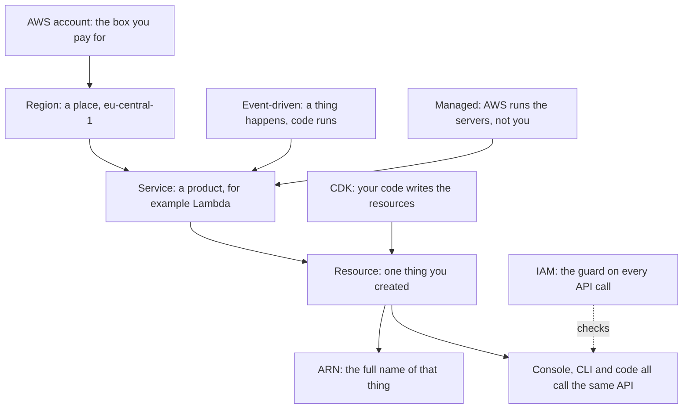

| Term | One-line meaning |
| --- | --- |
| **Account** | The box that owns and pays for everything you create; the strongest wall in AWS |
| **Region** | A group of data centres in one part of the world; Telegator uses `eu-central-1` (Frankfurt) only |
| **Availability Zone** | One data centre inside a Region, with its own power and network; two zones rarely fail together |
| **Service** | One AWS product, such as Lambda or DynamoDB; each has its own API |
| **Resource** | One thing you made with a Service: a queue, a table, a function |
| **ARN** | The full unique name of a Resource, like `arn:aws:sqs:eu-central-1:1234:telegator-dev-analyze`; permissions are written against ARNs |
| **API call** | Every action in AWS is an API call, whether you click the console, type the CLI, or run code |
| **IAM** | The guard that says yes or no to every API call (§14) |
| **Managed service** | AWS runs and patches the servers; you only bring configuration and code |
| **Serverless** | A managed service that also costs nothing when nothing happens; Lambda, SQS and DynamoDB on-demand are all serverless |
| **Event-driven** | Code runs because something happened (a message arrived), not because a clock told it to |
| **Infrastructure as code** | You describe resources in a programming language, and a tool creates them (§22) |

**Telegator is serverless and event-driven.** Nothing runs while nothing happens. That is the single idea the whole design is built on — and the one exception, the always-on Fargate task of §9.3, is the reason that section costs more than everything else combined.

## 13. Accounts, Regions and names

| Concept | One-line meaning | Status |
| --- | --- | --- |
| **Environment separation** | `dev` and `prod` are separate Accounts, so a mistake in one cannot touch the other | built — `infra/lib/config.ts` |
| **Resource name** | `telegator-{env}-{resource}` (§9.2) | built — `infra/lib/naming.ts` |
| **Service quota** | A limit per Account and Region on how many of a thing you may have | built as a *problem*: the concurrency trap in §26 |
| **Partition** | The part of an ARN saying which AWS world you are in (`aws`, `aws-cn`, `aws-us-gov`); code writes `Aws.PARTITION`, never the literal | built — `infra/lib/pipeline-stack.ts` |
| **Organization / OU / Service Control Policy** | A tree of Accounts, and rules that *remove* permissions from all of them at once | context — but it bit this project: a whole service was disabled above IAM (§26) |
| **Tag** | A key/value label on a Resource, used for cost reports and access rules | context |

## 14. IAM — who may do what

The most important service to understand, because every other section depends on
it. The rule is simple: **every API call is denied unless a policy allows it, and
an explicit deny always wins.**

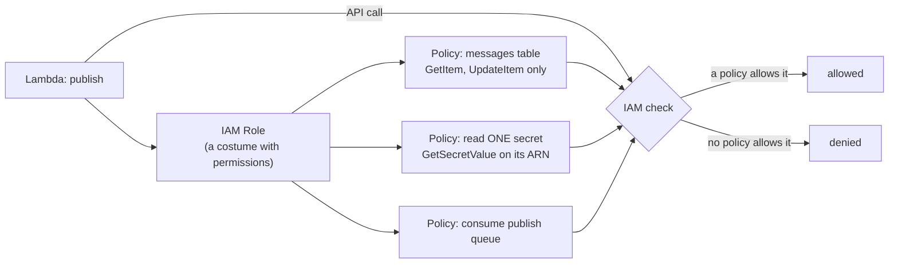

| Concept | One-line meaning |
| --- | --- |
| **Policy** | A JSON list of statements: *effect* (allow/deny), *action* (`dynamodb:Query`), *resource* (an ARN), optional *condition* |
| **Role** | A named set of permissions with no password of its own; a service "assumes" it and gets short-lived keys |
| **Principal** | Whoever is making the call: a role session, a user, or an AWS service |
| **Service principal** | An AWS service allowed to assume a Role, e.g. `amplify.amazonaws.com`; planned: `ecs-tasks.amazonaws.com` |
| **Least privilege** | Grant only the exact actions the code actually calls, on the exact ARNs it touches — this project's signature habit |
| **Trust policy** | The statement on a Role saying *who* may put the costume on; CDK writes it for you |
| **Condition** | An extra check, used when the action takes no ARN — e.g. `PutMetricData` limited to the `Telegator` namespace |
| **Resource policy** | A policy attached to the *resource* instead of the caller; how a queue lets another account send to it (context) |
| **STS** | The service handing out the short-lived keys when a Role is assumed; it works underneath, you never call it here (context) |

**Three traps worth remembering**, all of which §7.6 encodes:

- Some actions take no resource ARN at all (`cloudwatch:PutMetricData`, `GetMetricData`, `logs:GetQueryResults`). The only honest scope is `*` plus a condition where one exists.
- A DynamoDB `Query` on an index checks the **index ARN**, not the table ARN. A grant on the table alone passes every test and fails at runtime. This is why `infra/lib/grants.ts` exists.
- **The permission must name the service the client actually signs for**, not the one the documentation names. A role can look perfectly scoped and return 403 on every call (§26).

## 15. Lambda — code that runs only when needed

**One-line meaning:** you upload a function; AWS runs it when an event arrives,
bills per millisecond, and runs nothing between events. **built** — five of them,
inventoried in §7.5.

- **Benefit** — zero cost while idle (a perfect match for a pipeline that sleeps most of the day), scaling that follows the queues automatically, and no server to patch.
- **Tradeoffs** — an invocation may run at most 15 minutes (here capped at 300 s); a rarely-used function pays a cold-start delay; and local execution is never quite the real thing, which is why every AWS boundary here is a port with an in-memory fake.

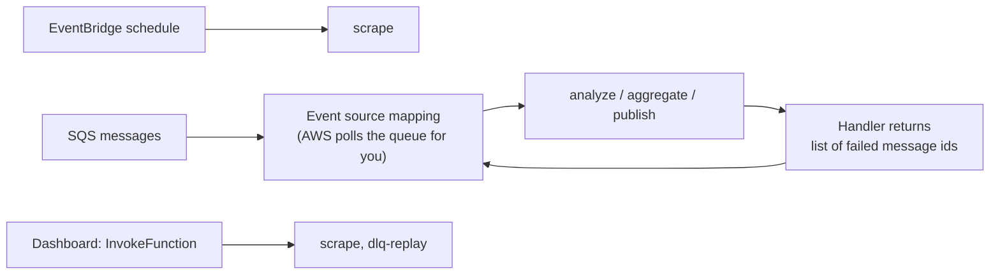

| Concept | One-line meaning |
| --- | --- |
| **Handler** | The exported function AWS calls with the event; here always `handler` in `handlers/*.ts` |
| **Runtime** | The language image the function runs on; Node.js 22 |
| **Architecture** | The CPU type; ARM64 (Graviton) — cheaper, and native to the Apple Silicon build machine |
| **Environment variable** | A named string given to the function at deploy time — table names, queue URLs; names live in `handlers/env.ts` |
| **Event source mapping** | The poller AWS runs against a queue on your behalf; you set batch size, it invokes with batches |
| **Partial batch failure** | The handler returns only the ids that failed, so nine good messages are not retried because of one bad one |
| **Reserved concurrency** | A fixed cap on parallel copies of one function |
| **Cold start** | Extra delay when AWS must create a fresh sandbox; harmless at this scale |
| **Bundling** | Packing the TypeScript into one JS file with esbuild at synth time; the AWS SDK is left out because the runtime ships it |

**Traps**

- **Reserved concurrency needs quota headroom** — see §7.5. Hence the escape-hatch flag.
- **`AWS_REGION` is reserved.** Lambda sets it; CloudFormation rejects a template that declares it. Read it, never write it.
- **Bundling falls back to Docker.** Without a local esbuild, CDK builds the bundle in a container. The dependency plus `forceDockerBundling: false` keeps `cdk synth` self-contained.
- **Partial batch failure is real money here.** Analyze receives 10 posts and calls a model for each; without `reportBatchItemFailures` one bad post makes AWS redeliver all 10, and you pay for nine successful calls again. One flag.

**Concurrency without a number:** aggregate and publish have *no* reserved concurrency. Their parallelism comes from FIFO message groups instead (§16). A reserved concurrency of 1 would be blunter — it would serialise across days too, which is more than correctness needs.

## 16. SQS — queues carry the work

**One-line meaning:** a durable mailbox between a producer and a consumer, so
they never need to be fast, alive, or awake at the same time. **built** — three
queues and three DLQs, specified in §7.3.

**The central design idea of the whole project:** the queue *is* the pipeline (§1.3). A post travels as a queue message and touches no table while in flight.

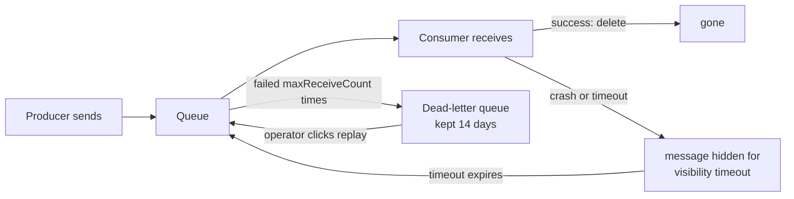

| Concept | One-line meaning |
| --- | --- |
| **Standard queue** | Best-effort order, unlimited throughput, possible rare duplicates; used for analyze, where no post depends on another |
| **FIFO queue** | Strict order and exactly-once *within a message group*; the name must end `.fifo`; used for aggregate and publish |
| **Message group** | The unit of order in a FIFO queue: one group is processed one message at a time, different groups run in parallel |
| **Deduplication id** | FIFO refuses a second message with the same id within 5 minutes; set explicitly here, never from a body hash |
| **Visibility timeout** | How long a received message stays hidden, so a slow worker is not doubled |
| **Dead-letter queue (DLQ)** | Where a message goes after failing too many times, instead of blocking the queue forever |
| **maxReceiveCount** | The "too many" number |
| **Retention** | How long an unconsumed message survives: 14 days, the SQS maximum |
| **Delivery delay** | Messages become visible only after a wait — the settle delay of §3.3 |
| **Queue depth** | `ApproximateNumberOfMessagesVisible` — how much work is waiting; the dashboard's health signal |

- **Benefit** — retry, back-pressure, failure isolation and a poison-message drawer, all for free; at idle, no messages means no invocations and no cost. §7.4 compares this to scheduled polling row by row.
- **Tradeoffs** — a message may arrive more than once (Standard), so consumers must tolerate repeats; FIFO buys order at a throughput cap; a message body maxes out at 256 KB; and 14 days is the *longest* anything can wait.

**Traps**

- **Visibility timeout too short is silent double-processing.** A slow worker's message reappears and a second worker takes it. The 6× rule (§7.3) exists for exactly this.
- **A FIFO queue's DLQ must itself be FIFO** — an AWS rule the specification did not state.
- **A FIFO queue cannot have a batching window.** CDK rejects it at synth (§25, R33).
- **Content-based deduplication is a trap for news** — see §7.3.

**Why the message groups are clever.** Aggregate must never process two posts of the same day at the same time; group = *date* gives exactly that, one day serial, different days parallel. Publish must never edit one Telegram message twice at once; group = *message id* gives exactly that, per message.

## 17. DynamoDB — the two tables

**One-line meaning:** a key-value database with the same speed at any size —
*if* you design the table around the questions you will ask it. **built** — two
tables, specified in §7.2.

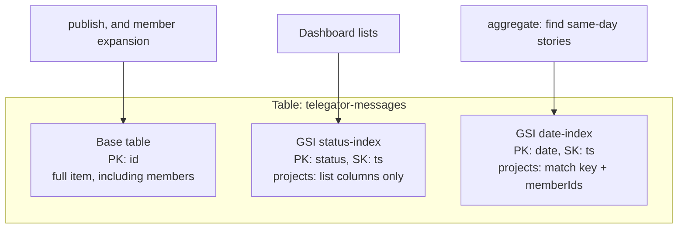

| Concept | One-line meaning |
| --- | --- |
| **Table** | A collection of items (rows) addressed by a key |
| **Item** | One record, a bag of attributes; no fixed schema — the Zod schemas in `lib/` are the real schema |
| **Partition key (PK)** | The attribute deciding where an item is stored; you can only fetch cheaply by it |
| **Sort key (SK)** | An optional second key ordering items within one partition value |
| **Global secondary index (GSI)** | A second copy of the table with a different key layout, kept in sync by AWS, so a second question becomes cheap |
| **Projection** | Which attributes a GSI copies; `INCLUDE` lists them, `ALL` copies everything |
| **On-demand billing** | `PAY_PER_REQUEST`: no capacity to guess, pay per read and write |
| **Query** | Fetch items by key, cheap and indexed |
| **Scan** | Read the whole table; acceptable only for the small `sources` table |
| **Point-in-time recovery (PITR)** | Continuous backup restoring the table to any second in 35 days; on for `messages` |
| **Removal policy RETAIN** | Deleting the stack leaves the table alive; both tables outlive their stack on purpose |
| **Single-table design** | Putting many entity types in one table; considered and *rejected* here — nothing is co-queried |

- **Benefit** — no server, no connection pool, no capacity planning, and read latency that stays flat whether the table holds a hundred stories or a hundred million.
- **Tradeoffs** — you must know your questions *before* designing the table: every cheap query is pre-built as a key or an index, and a question nobody planned for is a Scan. No joins, no ad-hoc SQL. Each GSI doubles the write cost of the attributes it projects.

**Traps**

- **A projection is a cost decision.** Every attribute a GSI projects is stored twice and written twice, which is why `status-index` excludes `members` and `date-index` carries only what §6 scores on.
- **A projection cannot be changed in place** — the two-deploy story in §7.2. `cdk diff` will not warn you.
- **An item may not exceed 400 KB**, which is why the member list is capped at 20.
- **`Query` on an index authorises against the index ARN** (§14).
- **`RETAIN` + a fixed name is a one-way street.** Delete the stack and the table survives — good — but a redeploy then fails because the name is taken. Back up before touching retained tables.

## 18. EventBridge — the only clock

**One-line meaning:** a managed event router; here used for its simplest skill —
firing a rule on a schedule. **built** — one rule, in §7.5.

Telegram cannot push to us, so the edge of the system must poll. Everything after that edge is event-driven: **scheduled at the edge, event-driven internally** (§7.4).

- **Benefit** — a cron job with no server to keep alive; if the target fails, the rule still fires next time; the `enabled` flag makes "deployed but quiet" a safe state.
- **Tradeoffs** — a schedule is a floor on latency (up to 30 minutes for a new post). AWS also offers two products with confusingly similar names: the older *EventBridge Rules* (used here, matching §1.2's "one EventBridge rule" and §7.5's `rate()` syntax) and the newer *EventBridge Scheduler* (time zones, one-off runs).
- **Traps** — the schedule defaults to disabled in **both** environments, for the reason in §9.2. And `rate(30 minutes)` is a fixed string format: a typo fails at deploy, not at synth.

## 19. OpenRouter — calling the AI model

**One-line meaning:** a single HTTPS endpoint fronting models from many vendors,
so calling Claude is a bearer-token API call rather than an AWS one. **built** —
the contract is §5.

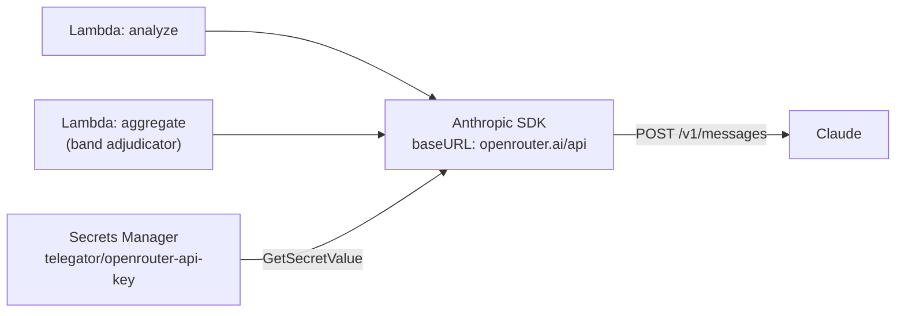

- **Benefit** — it works here, which Bedrock does not. Beyond that: one account reaches many vendors, model access needs no per-model approval, and the wire format is Anthropic's own Messages API — so §5.2's request bodies did not change when the provider did, and neither did the `Classifier` and `Adjudicator` ports.
- **Tradeoffs** — a bearer key is a real secret: it must be stored, rotated and granted, and IAM no longer authorises the inference itself, only the *read* of the token. Inference traffic leaves AWS, and a second vendor sits on the critical path.

**Traps**

- **An Organization can veto a whole AWS service.** Bedrock is not enabled in this account's Organization, so calls failed *above* IAM and no policy in this repository could fix it. That is what forced the provider swap — the same lesson as Amplify in §9.3: **account standing beats correct code**.
- **IAM cannot pin the model, and now cannot see it at all.** The only guard is the single model-id constant (§5.1).
- **The base URL must not carry the version segment** (§5.1). A 404 that reads like an outage.
- **State a length limit in the field description, not only in the schema** (§5.2). A schema-only cap is not honoured, and the failure arrives after you have paid for the call.

## 20. Cognito — who is allowed into the dashboard

**One-line meaning:** a managed user directory plus ready-made login pages (the
"hosted UI"); your app never sees a password. **built** — the rules are §8.6.

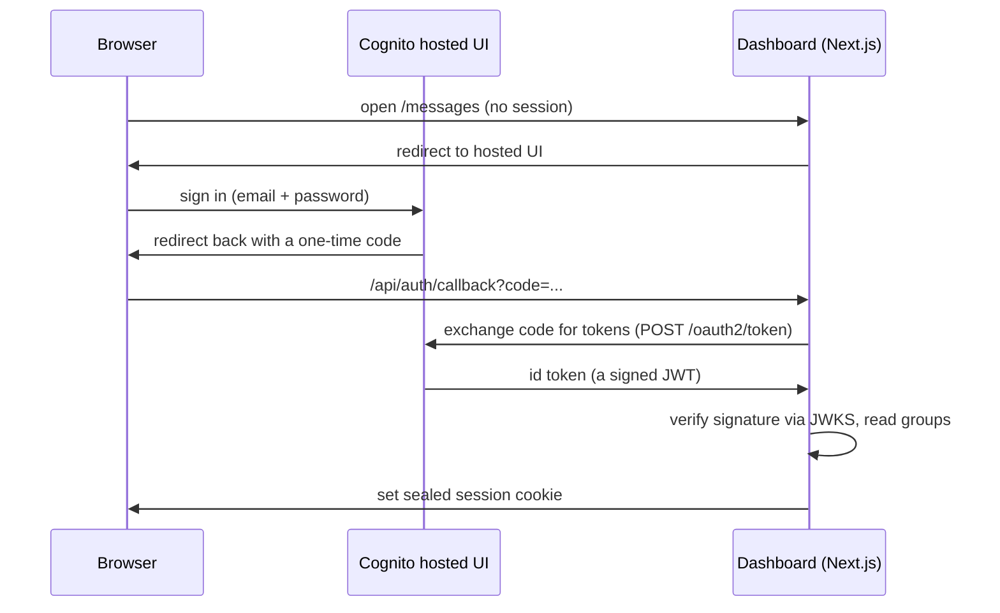

| Concept | One-line meaning |
| --- | --- |
| **User pool** | The user directory: accounts, passwords, groups |
| **App client** | One application's registration with the pool — its id, allowed callback URLs, allowed OAuth flows |
| **Hosted UI** | Cognito's own login pages on `<prefix>.auth.<region>.amazoncognito.com`; needs a domain to exist |
| **Authorization-code flow** | The browser gets a one-time code; the server swaps it for tokens; tokens never sit in a URL |
| **Callback URL** | Where Cognito may send the browser back to; anything not on the list is refused |
| **JWT / id token** | A signed statement of who the user is and which groups they are in |
| **JWKS** | The public keys used to check that signature, fetched from Cognito |
| **Group** | A named set of users; §8.6's roles are groups |
| **Precedence** | Group ordering where a **lower number wins** |
| **AdminCreateUser** | The only way into this pool: self-sign-up is disabled, an operator creates each user |

- **Benefit** — passwords, reset, login pages and token signing are AWS's problem; the app only verifies a signature and reads a group list.
- **Tradeoffs** — OAuth has many moving parts for what feels like a simple need; the hosted UI is barely customisable; configuration spreads across stack, environment and context.

**Traps**

- **Callbacks must be HTTPS**, with `http://localhost` as the only exception. This tiny rule shaped the whole hosting design (§9.3): an ALB has no free HTTPS, so CloudFront became mandatory.
- **The implicit flow is a security hole** — it returns tokens in the URL, where they land in browser history. Only the authorization-code flow is enabled.
- **Precedence is upside down** — lower is more powerful. The numbers are derived from the roles array so the two cannot drift.
- **Self-sign-up is one boolean away** from letting strangers register. `selfSignUpEnabled: false` is the security-critical property of that stack.

## 21. Secrets Manager — values that must not be written down

**One-line meaning:** a small database for secrets, where reading a value is an
IAM-checked API call that leaves an audit trail. **built** — the inventory is §7.6.

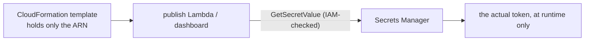

- **Benefit** — the value never appears in a template, an environment variable listing, or the repository. Anyone who can *describe* your infrastructure still cannot *read* your secrets.
- **Tradeoffs** — each secret costs ~$0.40/month plus per-call fees, and the value must be fetched at runtime. For non-secret configuration, plain environment variables are the right tool, and Telegator uses them for table names and queue URLs.

**Traps**

- **Pass the ARN, never the value.** An environment variable holding the session key would sit readable in the template — and that key can forge admin sessions.
- **Scope the grant to one ARN.** `GetSecretValue` on `*` would let the dashboard read the bot token too.
- **`Secret.fromLookup` breaks the build** — see §22.

## 22. CDK and CloudFormation

**One-line meaning:** CloudFormation creates AWS resources from a JSON template
and can roll the whole set back as one unit; the CDK lets you *write TypeScript
that generates that template*. **built** — the whole `infra/` directory.

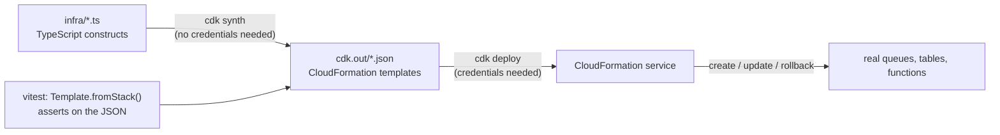

| Concept | One-line meaning |
| --- | --- |
| **Template** | The JSON description of resources CloudFormation executes |
| **Stack** | One deployed template; the unit of create, update and rollback — §9.1 lists them |
| **Construct** | A reusable building block in CDK code; `new Queue(...)` is a construct |
| **L1 / L2** | Two levels: L1 (`CfnApp`) mirrors raw CloudFormation exactly; L2 (`Queue`, `Table`) adds good defaults and helpers like `grantSendMessages` |
| **Synth** | Turning the TypeScript into templates; the fourth gate, and it must never need credentials |
| **Context** | `-c key=value` inputs read with `tryGetContext`; how deploy-time facts (image tags, callback URLs, secret ARNs) enter without lookups |
| **Cross-stack reference** | One stack using another's value; CDK writes the export/import wiring when you pass the construct object |
| **Assertions** | Tests over the synthesized JSON (`Template.fromStack`), e.g. "the publish role has no DeleteItem" |
| **Rollback** | A failed create/update is undone automatically; a stack whose *first* create failed sits in `ROLLBACK_COMPLETE` and can only be deleted |
| **Drift** | The gap between template and reality after manual console edits |

- **Benefit** — infrastructure is reviewed, tested and versioned like any other code. The L2 `grant*` helpers write correct IAM for you, and the assertion tests pin every hard-won decision so it cannot silently regress.
- **Tradeoffs** — L2 defaults are magic you must learn to read; the tool adds its own vocabulary on top of AWS's; and a synthesized template can still fail at deploy.

**Traps** — each cost this project real time:

- **Synth validates less than you hope.** CloudWatch metric math, GSI update rules and account quotas are all checked by the *service at deploy time*. An invalid alarm expression passed all four gates and failed on deploy.
- **L1 constructs accept unknown properties.** `iamServiceRole` vs `iamServiceRoleArn`: the wrong name compiled, synthesized, deployed — and the app ran with no role. Only `tsc` caught it. This is why the first gate is never skipped.
- **`fromLookup` is a poisoned convenience.** Any context lookup makes synth call AWS with credentials, destroying the one credential-free gate. It is banned outright.
- **`TableV2` is not "Table, newer".** It synthesizes a different resource type (`AWS::DynamoDB::GlobalTable`) with a different settings layout.

## 23. CloudWatch — metrics, logs and alarms

**One-line meaning:** the shared place every AWS service reports numbers and logs
into, plus alarms that watch those numbers. **built** — the metric set is §7.7.

Because posts in flight live in queues and not tables (§1.3), **CloudWatch is the only record of how much work happened.** The metrics are load-bearing.

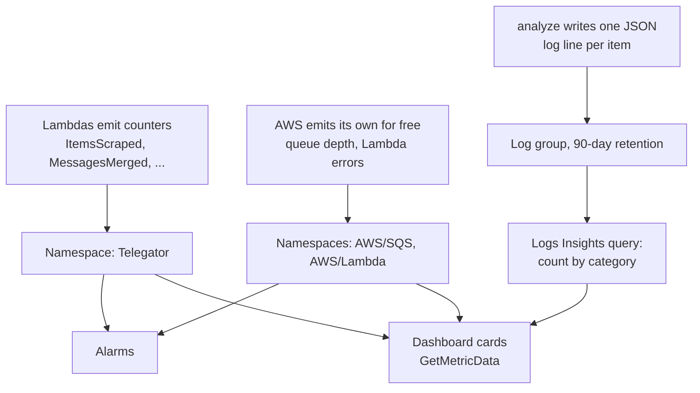

| Concept | One-line meaning |
| --- | --- |
| **Metric** | A named time series of numbers |
| **Namespace** | The folder metrics live in; custom ones in `Telegator`, AWS's own in `AWS/Lambda`, `AWS/SQS` |
| **Dimension** | A label that splits a metric, e.g. `ItemsScraped` per `Source` |
| **Alarm** | A rule that fires when a metric crosses a threshold for long enough |
| **treatMissingData** | What an alarm does when there is *no* datapoint; here always `NOT_BREACHING` |
| **Metric math** | An expression over metrics, evaluated by CloudWatch — the error *rate* is `100 * errors / invocations` |
| **Log group** | The container for one function's logs, with retention and access control |
| **Retention** | How long logs are kept; **the default is forever**, and billed forever |
| **Structured logging** | One JSON object per line, so queries can address fields |
| **Logs Insights** | A query language over log groups; the category chart is a query, not a metric |

- **Benefit** — every service reports in without being asked; custom counters are two lines of code; alarms replace a human watching a screen.
- **Tradeoffs** — custom metrics are billed per name-and-dimension combination (§7.7); metrics arrive with a delay. This is monitoring, not tracing.

**Traps**

- **An empty queue reports nothing, not zero.** An alarm treating missing data as breaching would ring forever on a healthy system.
- **Metric math is parsed only at deploy.** `MAX([series, 1])` looks fine, synthesizes fine, and is rejected by the service.
- **A log format change can silently blank a feature.** Lambda's `LoggingFormat.JSON` wraps each record in an envelope; the category query would then match nothing, and the chart would be empty with no error anywhere. `TEXT` is pinned.
- **Log group names collide.** Declaring `/aws/lambda/<name>` yourself while CDK's managed-group feature also declares it fails the deploy — and until it collided it was inert, because the function wrote to the managed group instead. Create the group first and hand it to the function.

## 24. The wider AWS map

Telegator uses a narrow slice of AWS. This section exists so the names in blogs
and interviews are not strangers. **Used** points back to a section above;
everything else is context.

### Compute

| Concept | One line | Here |
| --- | --- | --- |
| **EC2** | A rented virtual machine billed per second; you own patching and scaling | context |
| **Auto Scaling Group** | A fleet of EC2 held at a target size, replacing what fails | context |
| **EKS** | Managed upstream Kubernetes; AWS runs the control plane | context |
| **ECS** | AWS's own container orchestrator: describe a task, it keeps N copies running | planned — §9.3 |
| **Fargate** | The "no servers" way to run ECS tasks: AWS supplies the machines, you pay per vCPU-second and GB-second | planned — §9.3 |
| **ECR** | The private Docker image registry, with lifecycle rules to expire old images | planned — §9.3 |
| **App Runner** | Image in, HTTPS out — the "easy mode" of what §9.3 builds by hand | probed, rejected |
| **Graviton** | AWS's ARM processors; the reason the Lambdas and the planned task say ARM64 | used — §7.5, §9.3 |
| **Spot / Savings Plan** | Discounts for interruptible or committed workloads | context |

### Networking (all planned, §9.3)

| Concept | One line |
| --- | --- |
| **VPC** | Your own private network inside a Region; nothing enters or leaves unless you build a door |
| **Subnet** | A slice of the VPC pinned to one AZ; **public** (routed to an internet gateway) or **private** |
| **Internet gateway** | The door that makes public subnets reachable from the internet |
| **NAT gateway** | A one-way door: private subnets call out, nothing calls in; billed per hour *and* per GB |
| **Route table** | The rules deciding where a subnet's traffic goes |
| **Security group** | A stateful allow-list firewall on a network interface; reply traffic needs no rule, and rules can reference *other groups* rather than IP ranges |
| **VPC endpoint (gateway)** | A free private path to S3 or DynamoDB, skipping NAT and its per-GB fee |
| **VPC endpoint (interface) / PrivateLink** | A paid (~$7.30/mo per AZ) private entrance to other AWS services — and coverage gaps decide designs (§9.3) |
| **Application Load Balancer** | An HTTP-aware traffic distributor: listeners, rules, and health checks over a target group |
| **Target group** | What traffic is forwarded to, plus the health check that decides who receives it |
| **CloudFront** | The CDN: terminates HTTPS at edge locations on a free `*.cloudfront.net` name and forwards to an origin |
| **ACM** | The certificate service; it issues only for domains you *prove you control* — which an `*.elb.amazonaws.com` name never is |

### Storage, messaging, operations

| Concept | One line | Here |
| --- | --- | --- |
| **S3** | Object storage by key; very durable, no filesystem | mentioned — the planned gateway endpoint serves ECR layers from it |
| **EBS / EFS** | A block disk for one instance / a shared filesystem for many | context |
| **RDS / Aurora** | Managed relational databases; the road not taken — this data is key-value shaped | context |
| **ElastiCache** | Managed Redis/Memcached for repeated reads | context |
| **OpenSearch / Redshift / Athena** | Text search / warehouse analytics / SQL directly over S3 files | context |
| **SNS** | One message fanned out to many subscribers; SQS is one-to-one | context |
| **Kinesis / MSK** | Ordered, replayable streams; readers keep a position instead of consuming | context |
| **Step Functions** | A state machine coordinating services with retries and waits as data | context — the queues *are* Telegator's state machine |
| **API Gateway** | A managed HTTP front door with auth and throttling | context — server actions play that role here |
| **CloudTrail** | The audit log of every API call in the account | context |
| **AWS Config** | Configuration history of resources, judged against compliance rules | context |
| **X-Ray** | Tracing one request's path across services | context |
| **Systems Manager** | Fleet operations and a shell onto instances without SSH | context |
| **KMS** | Managed encryption keys that never leave the service; everything here uses AWS-owned keys implicitly | context |
| **WAF** | Rule-based request filtering at the edge | context |

### Ideas rather than services

| Concept | One line | Here |
| --- | --- | --- |
| **Shared responsibility model** | AWS secures the cloud; you secure what you put in it | throughout — IAM scoping, `selfSignUpEnabled: false`, secret handling |
| **RTO / RPO** | How long recovery may take / how much data it may lose | used — PITR on `messages` is an RPO decision (§7.2) |
| **Idempotency** | Repeating a request changes nothing more — what makes at-least-once delivery safe | used — §6.3 |
| **Exponential backoff with jitter** | Retrying after a growing, randomized delay so callers do not stampede | used — inside every AWS SDK client |

---

# Part III — Record

## 25. Reconciliations

Where the code diverges from Part I, the divergence carries a number. The comment
that makes it names the number and its reason; this register holds the full
account, so a reader meeting `R46` in a comment can find out what it settled and
why without reading the module.

Numbers are permanent. `R6` was never issued.

| # | Settles | What the code does instead, and why |
| --- | --- | --- |
| **R2** | §5.1 vs §11.1 | §5.1 specified `claude-opus-5`; §11.1 decided `claude-haiku-4.5`. §11 is the later, explicitly-resolved position, so the haiku tier wins. Written once, as a single constant, so the disagreement cannot be re-litigated in code. Re-slugged by R50 into OpenRouter's `vendor/model` form. |
| **R3** | §5.2 | The adapter asserts nothing about *what* a model returns — its job is the request shape and the handling of bytes handed back. Every test injects a fake client; no test touches the network. |
| **R4** | §5.4 | The category block contains **29** entries, while its own heading and two cross-references say 35, and two entries sit off its four-column grid — what removed text leaves behind. The six missing names are not recoverable from the document, so the list that ships is the list the document contains, and the discrepancy is recorded rather than guessed at. It matters beyond arithmetic: the enum constrains model output, so a wrong list makes a legitimate category unsayable. |
| **R5** | §3.2 | The drop rule tests `category === "crime&law"`, which is **not** one of §5.4's values — so the model cannot emit it, the rule can never fire, its metric is always zero, and crime content is published. Implemented exactly as written and pinned by test rather than silently corrected: changing the string changes what reaches production channels, which is the specification owner's decision. |
| **R7** | §6 | Building a record by spreading the whole item would write `body`, `kind`, `importance`, `properNames` and `forwardedFrom`, none of them in §2.3's field table. The descriptive fields are picked explicitly. |
| **R8** | §6, §2.3 | §6 assigns `ts` on neither branch, yet §2.3 makes it the sort key on both GSIs. Every write carries it. |
| **R9** | §6, §7.2 | Candidates come from `date-index`, which projects no `members`. A merge is therefore emitted as an attribute-level operation, and the matched record's members are loaded from the base table first. |
| **R10** | §6 | Re-querying per item lets an item that scores below threshold against the batch's fresher copy still match the *stale stored copy* and overwrite the batch's own work. Pass 2 skips any candidate already touched in this batch. |
| **R11** | §6, AC-3.7 | Stamping `ts: now()` unconditionally makes byte-identical replay impossible. An existing member keeps its original `ts`; without that, every replay would rewrite every block and §3.4's ordering would shuffle. |
| **R12** | §3.4, §11.3 | The hashtag line **is** appended — §11.3 is the later decision. Appending makes overflow reachable for the first time, so a truncation rule has to exist: drop the hashtag line first, then reduce member blocks. Hashtags are derived metadata and reconstructible; a member block is the only surviving rendering of a scraped post. Content outlives metadata. |
| **R13** | §3.4, AC-4.2 | The photo threshold is **1012**, not the 1024-character caption limit: 1012 is the stricter bound *and* the one an acceptance criterion asserts. This makes the 1013–1024 band unreachable. Kept separate from Telegram's protocol limit, which is a different number for a different reason. |
| **R14** | §3.1, AC-1.2 | §3.1's two-tier formula puts a hot source in the same 30-minute bucket as a warm one, contradicting its own prose and failing AC-1.2 for any hot source polled recently. Prose and criterion agree against the formula, so the formula is the defect: the hot tier is restored as a leading disjunct, with the published expression kept verbatim below it. |
| **R15** | §2.1, §9.4 | The legacy export carries no `lastNonZeroCount`, so seeding it from `lastCount` is the closest true statement available: the last poll's count was, at the time, the last non-zero one if it was non-zero. |
| **R16** | §2.1, §2.3 | A soft-deleted record must be neither a merge target nor a dashboard row, and §3.1's selection never consults the flag on its own. The condition is written once and applied to every read of both tables. |
| **R17** | §2.3 | `status: error` has no writer in the current code — only the DLQ handler is specified to set it. |
| **R18** | §10.1 | §10.1's DynamoDB Local and ElasticMQ need Docker. The harness instead wires the stages the way SQS wires them and no more tightly: every hand-off is a serialised queue message, never an object passed straight from one stage to the next. |
| **R19** | §3.3 | No per-message `DelaySeconds`. SQS FIFO supports only a queue-level delay, so the settle delay is configured on the publish queue itself. |
| **R20** | §9.4, §11.6 | Seeding covers `sources` only; §11.6's "skip the import entirely" wins over the message-migration row. |
| **R21** | §9.4 | `--data-dir` is required rather than defaulted: the export lives outside this repository. Writing is opt-in — a migration is hard to undo once it has run. |
| **R22** | §7.1, §7.5 | `events.Rule`, matching §1.2's "one EventBridge rule" and §7.5's `rate()` syntax, rather than the newer EventBridge Scheduler. |
| **R23** | §9.2, §9.5 | The schedule is **off unless asked, in both environments**. §9.5 deploys prod disabled and enables it only after a 48-hour soak, so this cannot be inferred from the environment name. |
| **R24** | §7.6, §7.7 | §7.6 omits `cloudwatch:PutMetricData`, yet §7.7's counters are unemittable without it and §7.7 makes them the system of record for volume. Granted, conditioned on the `Telegator` namespace. |
| **R25** | §7.7 | §7.7 alarms on `SourceStale` for any source, but the metric is dimensioned by a source discovered at runtime. A CloudWatch alarm cannot enumerate that at synth time and lookups are banned, so the metric is emitted undimensioned as well and the alarm watches that. |
| **R26** | §8.3, §7.2 | The expandable member list is a lazy per-row base-table `GetItem`, because no index projects `members`. Rendering it from the list query would fail *silently* — the map is simply absent, so every row would expand to nothing. |
| **R27** | §7.2 | Defines the `status-index` projection as a schema, so the dashboard's list type and the index's `INCLUDE` list cannot drift apart. Amended by R44 and R51. |
| **R28** | §10.4 | The end-to-end latency target is checkable in a way the specification did not intend: its own stated arithmetic contradicts it. Recorded rather than corrected. |
| **R29** | §3.1, §6 | §3.1 offers the `members` map as a safety net if the cursor ever fails. It holds only while the re-scraped duplicate lands on the same `date`, because candidates come from `date-index` for that date alone. The same cursor failure either side of midnight produces different outcomes — that is the bound, asserted rather than merely recorded. |
| **R30** | §6 | The image field keeps an existing value including an empty string — `??`, not `\|\|`. |
| **R31** | §3.2 | Read literally, the dropped body is a 12-character string, which §3.1's tokeniser would essentially never produce — so the rule would never fire. The parenthetical states the intent (a bare link with no prose), so the pattern is implemented instead of the example. |
| **R32** | §3.1 | An emoji sprite served as a background image is not the post's photo. Detected by URL pattern, falling back to the carrying element's class so a sprite from another host is still not mistaken for one. |
| **R33** | §3.3, §7.3 | Both give the aggregate queue a 300 s batching window, and **AWS does not support one on a FIFO queue** — CDK rejects it at synth. `batchSize: 10` is all that survives, and §7.4 has already reasoned about that outcome. |
| **R34** | §8.6, revises R24 | R24 withheld Cognito from the dashboard role because §8.2–§8.4 define no user-management surface. But §8.6 states normatively that a disabled user is rejected at every action, and enforcing that needs a live read of one field. `AdminGetUser` is that read — and the only Cognito action the role holds. Narrows R24 rather than relaxing it. |
| **R35** | §8.5 | The 60 s cache decorates the ports rather than wrapping each card, so the rule holds for reads added later. Deliberately **not** Next's `unstable_cache`, which a page may still add on top for a cache shared across instances. |
| **R36** | §8.5 | Recent messages come from `status-index`, `ts` descending. |
| **R37** | §8.4 | Pins the three message fields a server action will accept, so the table's editable set and the action's schema cannot drift. |
| **R38** | §6 | A create is conditional on `attribute_not_exists(id)`. The condition *is* the behaviour: without it a replay silently overwrites. The in-memory fake enforces it too, or the tests would not be testing the same thing. |
| **R39** | §3.3 | A merge that changes nothing a reader would see omits the status reset, so a replayed message stays `published` instead of being edited with its own text. A create always publishes: there is no stored record for it to render identically to. |
| **R40** | §7.5 | Reserved concurrency is behind a flag, because a reservation is creatable only while the account keeps 5 concurrent executions unreserved — and a cold account's entire quota is 5. |
| **R41** | §7.7 | Log retention has to apply to the group the function actually writes to. CDK's managed-log-group feature makes every function declare its own `/aws/lambda/<name>`; declaring a second beside it collides on deploy, and until it collided it was **inert**. The group is created first and handed to the function. |
| **R42**, **R49** | §7.6 | Two rounds getting Bedrock's IAM right: the statement had to name the service the client actually signed for (`bedrock-mantle:CreateInference`), not the action the documentation named (`bedrock:InvokeModel`). Both are superseded by R50, but the lesson outlived the provider. |
| **R43** | §5.3 (as was) | The embedding adapter is removed entirely. Dedup no longer calls a model at all except for R46's adjudicator, which goes through the same Messages API as classification. |
| **R44** | §7.2 | The `embedding` Binary attribute is replaced by three String Lists plus `memberIds`, and `date-index` projects those instead. The candidate query drops from ~4 KB per candidate to a few hundred bytes. |
| **R45** | §3.3, §6 | Merging two messages by elementwise mean has nothing to average without vectors. A merged message's match key is the **sorted union** of the two: it keeps every discriminating term either side contributed and — unlike a mean — is commutative and idempotent, which is what lets a replayed merge write the same bytes as the original. |
| **R46** | §6 | The whole matching rule. Embedding the batch and comparing cosines against a single threshold is replaced by an in-process match key, a weighted Jaccard score, and a **band**: above merge and below distinct are decided from the `date-index` projection alone — no model call, no base-table read — and the strip between them is the only thing a model ever sees, in one call for the whole batch. |
| **R47** | AC-3.1, AC-3.3, AC-3.6 | Restated from cosine terms into score terms. The ids are unchanged; only the threshold vocabulary is. |
| **R48** | §10.3 | Recalibration rewritten: no embedding step, a 2-D sweep, a three-way objective, and a measured adjudicator accuracy. The labelled set survives unchanged — it is model-agnostic, and it is the real asset. |
| **R50** | §5.1, §7.6 | The provider swap. Bedrock is disabled above IAM by this account's Organization, so no role policy could ever have reached it. `bedrock.ts` became `openrouter.ts`: the request shape did not change, only where the client points and how it authenticates. §7.6 gains a second secret, and the two stages that call a model are the two that read it. |
| **R51** | AC-3.7, §7.2 | Byte-identical replay is guaranteed by an explicit item-id short-circuit over the projected `memberIds`, rather than emerging from idempotent member writes. The wording of AC-3.7 is unchanged; how it holds is not. It has to be identity-based, because §3.3 lets the newest item overwrite the descriptive fields, so a replayed item may no longer resemble the message it belongs to. |
| **R52** | §9.1 | The app stack also declares the branch its host builds, which §9.1's inventory does not name. A host with no branch has nothing to build and serves nothing. |
| **R53** | §8.4 | "Publish now" is `admin` only, offered only on the `topublish` tab, and capped server-side rather than trusting the caller's number. |
| **R54** | §2.1, §3.1, §8.3, §8.4, §9.4 | `sources.tgChannel` is `sources.target`, a **comma-separated list** of target ids carried verbatim into the item payload as `target` and into `messages.tgChannel`, whose name is kept because it sits in the `status-index` projection (§7.2 L638). A stored `tgChannel` on a source is an orphan the schema strips; `scripts/migrate-targets.ts` copies it across before deploy. The full account is `docs/.spectomat/done/multi-target.spec.md` (or `specs/` while it is being built). |
| **R55** | §2.3, §3.3, §3.4, §8.4 | Publish sends **once per target**: `messages.posts` maps each canonical target id to its `{tgId, tgAt}`, written whole after every send; `tgId`/`tgAt` are frozen legacy fields read only by the first-target fallback. A post is current when `tgAt >= ts` and is skipped; a rejected send fails the record so the redelivery sends to the rest; a sent-but-unrecorded post is acknowledged. `republishMessage` bumps `ts` so every post is re-sent. Base table only; no projection changes. |

## 26. Traps this project actually hit

Every row cost real time, and every row is now pinned by a test or a comment so
it cannot happen twice silently.

| # | Trap | The lesson | Recorded in |
| --- | --- | --- | --- |
| 1 | Model calls 403'd with a "correct" role | The permission must name the service the client *actually signs for* | §25 R42/R49 |
| 2 | The model service was refused above IAM | An AWS Organization can disable a whole service; no policy in the repository can help | §25 R50, §19 |
| 3 | Amplify `CreateApp` returned 401 | Account standing beats correct templates | §9.3 |
| 4 | GSI projection change rejected at deploy | `cdk diff` predicts from the template only; DynamoDB refuses in-place projection edits — plan two deploys | §7.2, §17 |
| 5 | Reserved concurrency uncreatable | A cold account's whole quota is 5; reserving any breaks stack creation | §25 R40 |
| 6 | Alarm metric math failed only at deploy | Synth checks shape, the service checks meaning | §23 |
| 7 | FIFO queue rejected its batching window | An AWS constraint absent from the specification; CDK caught it at synth | §25 R33 |
| 8 | Log group name collision on deploy | Create the group yourself and pass it in; two owners of one name cannot coexist | §25 R41 |
| 9 | Wrong L1 property name accepted silently | `iamServiceRole` vs `iamServiceRoleArn` — only `tsc` caught an app running with no role | §22 |
| 10 | `AWS_REGION` cannot be declared | Lambda reserves it; CloudFormation rejects setting it — read it, never write it | §15 |
| 11 | Retained tables blocked a redeploy | `RETAIN` + a fixed name orphans tables on stack delete; back up before touching them | §17 |
| 12 | Root user could not assume roles | Deploy as an IAM identity, never as root | §9.1 |
| 13 | Health checks would crashloop the planned service | An all-authenticated app answers 401 on `/`; give the load balancer its own unauthenticated route | §9.3 |
| 14 | A "fully private" VPC would break only login | No VPC endpoint exists for the Cognito hosted UI; NAT is mandatory | §9.3 |
| 15 | A schema-only length cap was ignored | State the limit in the field *description*; the failure arrives after the call is paid for | §5.2, §19 |
| 16 | Line-number citations rotted silently | 16 of 1503 pointed at the wrong section while all four gates stayed green | §27 |

Read the table twice and one pattern appears: **the four local gates verify
shape, and AWS verifies meaning at deploy time.** Synth passing is the beginning
of confidence, not the end.

## 27. Where each concept lives

| You want to see... | Open |
| --- | --- |
| All stacks assembled, in order | [infra/lib/app.ts](../infra/lib/app.ts) |
| Tables, GSIs, projections, PITR, RETAIN | [infra/lib/data-stack.ts](../infra/lib/data-stack.ts) |
| Queues, FIFO groups, DLQs, delays | [infra/lib/queue-stack.ts](../infra/lib/queue-stack.ts) |
| Lambdas, triggers, IAM grants, alarms | [infra/lib/pipeline-stack.ts](../infra/lib/pipeline-stack.ts) |
| Cognito pool, hosted UI, groups | [infra/lib/auth-stack.ts](../infra/lib/auth-stack.ts) |
| The dashboard host and its role | [infra/lib/app-stack.ts](../infra/lib/app-stack.ts) |
| Narrow IAM as a habit | [infra/lib/grants.ts](../infra/lib/grants.ts) |
| The match key, the score, the band | [lib/dedup/](../lib/dedup/) |
| The whole of §6 | [lib/dedup/dedupBatch.ts](../lib/dedup/dedupBatch.ts) |
| The OpenRouter client and model id | [lib/ai/openrouter.ts](../lib/ai/openrouter.ts), [lib/ai/constants.ts](../lib/ai/constants.ts) |
| The adjudicator | [lib/ai/adjudicator.ts](../lib/ai/adjudicator.ts) |
| OAuth token exchange and JWT checking | [lib/auth/cognito.ts](../lib/auth/cognito.ts) |
| Reading metrics, queue depth, Logs Insights | [lib/aws/observability.ts](../lib/aws/observability.ts) |
| Emitting custom metrics | [lib/metrics/cloudwatch.ts](../lib/metrics/cloudwatch.ts) |
| The calibration sweep | [lib/calibration/](../lib/calibration/) |
| That every AC here is named by a test | [test/acceptance.test.ts](../test/acceptance.test.ts) |
| That every `§x.y L###` citation still resolves | [test/specCitations.test.ts](../test/specCitations.test.ts) |
| That the dashboard never reaches the pipeline | [test/boundaries.test.ts](../test/boundaries.test.ts) |

---

# Part IV — Building it

Parts I–III say what the system does and why. This part says what it is made of.
It exists because everything in it was discovered by reading the repository
rather than the document, and a reader rebuilding from Parts I–III alone would
have to re-derive all of it.

## 28. Toolchain and layout

**Runtime:** Node.js 22, ESM (`"type": "module"`), TypeScript throughout.

| Dependency | Why this one |
| --- | --- |
| `zod` 4 | **Schemas are the source of truth**; every type comes from `z.infer`. Never declare a type and a schema separately. |
| `@anthropic-ai/sdk` | §5.1's client. Its default export takes `baseURL` + `apiKey`, which is what makes OpenRouter a two-line swap. |
| `@aws-sdk/client-*` v3 | One client per service, plus `lib-dynamodb` for the document interface. The Lambda runtime ships the SDK, so it is excluded from the bundle. |
| `aws-cdk-lib` 2 + `constructs` | §9's infrastructure. |
| `next` 16, `react` 19 | §8's App Router dashboard. |
| `jose` | ID-token verification against Cognito's JWKS (§8.6). |
| `server-only` | Marks modules that must never reach a client bundle. |
| `vitest` 4 | The suite. **Vitest 4 uses oxc, not esbuild**: JSX goes in `oxc: { jsx: { runtime: "automatic" } }`, and an `esbuild.jsx` setting is accepted and then silently ignored. |
| `@biomejs/biome` 2 | Lint and format, in one tool. |
| `tsx` | Runs the `scripts/` entry points directly. |
| `aws-sdk-client-mock` | Declared, and deliberately **unused**: its `mockClient()` signature is built against an older `@smithy/types` than the installed SDK and does not typecheck against it, and 4.1.0 is the latest release. Inject a structural client port and stub that instead. |

**Layout.** Every rule lives in `lib/`; everything else is a wrapper over it.

```
lib/            every rule, and the only place decisions are made
  ai/           classifier + adjudicator adapters, prompt, schemas, constants
  auth/         Cognito OAuth, JWT verification, session, roles
  aws/          CloudWatch metrics/logs reads (observability)
  calibration/  the §10.3 sweep, its file formats, the record schema
  clock.ts      the injected clock — nothing else reads the time
  dashboard/    the §8.5 computations, caching, triggers
  db/           DynamoDB repositories for sources and messages
  dedup/        match key, score, band, the §6 algorithm
  domain/       Zod schemas and derived types: source, item, message, ids, tags
  deploy/       argument parsing shared by the ops scripts
  logging/      the structured logger and its shared field names
  metrics/      the §7.7 counters
  ops/          region and --env parsing shared between scripts
  pipeline/     the four stages plus the DLQ replay, wiring only
  queues/       SQS producers and payload schemas
  seed/         the §9.4 migration
  telegram/     HTML parser, bot client, HTTP adapters
  ui/           filter, sort, column and chart helpers shared by components
handlers/       Lambda entry points — thin wrappers over lib/pipeline
infra/lib/      the CDK stacks of §9.1
app/            App Router routes (§8.2)
components/     dashboard React components
actions/        server actions (§8.4)
scripts/        operator entry points (§33)
test/           cross-cutting invariants; unit tests sit beside their module
```

**Conventions that are enforced, not preferred:**

- **Relative imports carry no extension.** Write `"../lib/clock"`, never `"../lib/clock.js"`. `tsc`, Vite, esbuild and tsx all perform the `.js` → `.ts` substitution; **Turbopack does not**, so the extension form passes every check and then makes every dashboard route 500 with `Module not found`. There is no Turbopack setting that restores it.
- **A constant needed by two layers moves to a module neither owns.** The dashboard may not import `lib/pipeline/` (§8.2), so a shared literal cannot live in either.
- `console` belongs in `scripts/` only. Everywhere else, the injected logger.
- Magic numbers are banned in `lib/`, `handlers/` and `actions/`. Every value in §31 is a named constant.
- A source scan that names what it forbids will match itself. Exclude the scanning file, or scan only shipped source.

## 29. Configuration contract

Nothing reads an environment variable by an inline string. Both maps below live
in one module that the CDK stacks import — a stack that forgets a variable is
then a grep away rather than a runtime discovery.

**The pipeline's, supplied by §9.1's pipeline stack:**

| Variable | Carries |
| --- | --- |
| `TELEGATOR_SOURCES_TABLE` | §2.1's table name |
| `TELEGATOR_MESSAGES_TABLE` | §2.3's table name |
| `TELEGATOR_ANALYZE_QUEUE_URL` | §7.3's three queue URLs |
| `TELEGATOR_AGGREGATE_QUEUE_URL` | |
| `TELEGATOR_PUBLISH_QUEUE_URL` | |
| `TELEGATOR_ANALYZE_DLQ_URL` | the matching DLQs, which §3.5's replay handler drains |
| `TELEGATOR_AGGREGATE_DLQ_URL` | |
| `TELEGATOR_PUBLISH_DLQ_URL` | |
| `TELEGATOR_TELEGRAM_SECRET_ARN` | §7.6's bot-token secret |
| `TELEGATOR_OPENROUTER_SECRET_ARN` | §7.6's model-key secret |

**The dashboard's, in addition:**

| Variable | Carries |
| --- | --- |
| `TELEGATOR_SCRAPE_FUNCTION_NAME` | the "Scrape now" target |
| `TELEGATOR_DLQ_REPLAY_FUNCTION_NAME` | the replay target |
| `TELEGATOR_PUBLISH_FUNCTION_NAME` | the "Publish now" target (§25, R53) |
| `TELEGATOR_USER_POOL_ID` | §8.6's pool |
| `TELEGATOR_USER_POOL_CLIENT_ID` | |
| `TELEGATOR_COGNITO_DOMAIN` | the hosted-UI domain |
| `TELEGATOR_APP_URL` | this app's own origin, for callback construction |
| `TELEGATOR_SESSION_SECRET_ARN` | the session key's **ARN** — never its value |
| `TELEGATOR_ANALYZE_LOG_GROUP` | the group §7.7's category query runs over |

**`AWS_REGION` is deliberately absent.** Lambda sets it and CloudFormation
rejects a template that declares it, so it is read, never written.

**Reads fail loudly and by name.** An unset variable would otherwise build a
client pointed at `undefined`, and the AWS error that follows names neither the
function nor the variable.

**Synth-time context** (`-c key=value`), which is how deploy-time facts enter
without a `fromLookup` (§22):

| Key | Effect |
| --- | --- |
| `env` | `dev` or `prod`; drives every resource name |
| `scheduleEnabled` | §9.2's opt-in; also triggers §10.3's production gate |
| `reserveConcurrency` | §25 R40's escape hatch for a cold account |
| `settleDelaySeconds` | §7.3's publish-queue delay |
| `sessionSecretArn` | §8.6's session key |
| `appUrl`, `callbackUrls`, `logoutUrls` | the two-phase deploy of §9.3 |
| `repository`, `branch`, `githubTokenSecretName` | the current host's build source |

## 30. Boundaries: ports and fakes

**Every AWS, Telegram and model boundary is an interface in a `ports.ts`, with
an in-memory fake beside the tests. No test touches the network** — the suite
forbids it, and the build machine can reach neither AWS nor a model provider.

| Port | Behind it |
| --- | --- |
| `lib/ai/ports.ts` | `Classifier` (§5.2) and `Adjudicator` (§5.3) |
| `lib/auth/ports.ts` | token exchange, JWKS, the cookie jar, the disabled-user read |
| `lib/aws/ports.ts` | CloudWatch metric reads, Logs Insights, queue attributes |
| `lib/db/ports.ts` | the two repositories of §2 |
| `lib/metrics/ports.ts` | §7.7's counters |
| `lib/queues/ports.ts` | §7.3's producers |
| `lib/telegram/ports.ts` | the page fetcher and the bot client (§4) |

This is not only a local convenience. It is what lets §10's acceptance criteria
be checked at all: a test that needed a live model could not assert "these two
posts produce one message with two members".

**The clock is a port too.** Nothing calls `Date.now()` directly. Several
properties — AC-3.7's byte-identical replay, the member ordering of §3.4, the
60 s cache of §8.5 — are false under a real clock and untestable without control
of it.

**Ports are shaped by the access pattern, not by the SDK.** A DynamoDB port
exposes `queryByDate`, not `query`; the projection each one returns is a
distinct type, so dashboard code cannot read an attribute the index never
returned (§7.2).

## 31. Tunable constants

The one place any of these is written. Each is a named constant in code, and
`style/noMagicNumbers` keeps it that way.

| Constant | Value | Set by |
| --- | --- | --- |
| `MERGE_THRESHOLD` | **0.72** | §6.2 — provisional until §10.3's sweep |
| `DISTINCT_THRESHOLD` | **0.35** | §6.2 — provisional until §10.3's sweep |
| `SCORE_WEIGHTS` | entities **0.60**, titleTokens **0.25**, tags **0.15** | §6.2 — provisional |
| `MATCH_KEY_CAP` | 256 terms per set | §6.1 |
| `MAX_MEMBERS` | 20 | §2.3 |
| `MEMBER_RENDER_LIMIT` | 12 | §3.4 |
| `MAX_BATCH_SIZE` | 10 | §7.3 |
| `SETTLE_DELAY_SECONDS` | 300 | §11.4 |
| `SQS_MAX_DELAY_SECONDS` | 900 | SQS's own ceiling on the above |
| photo suppression threshold | 1012 characters | §25, R13 — **not** the 1024 caption limit |
| `TELEGRAM_MESSAGE_LIMIT` | 4096 | §4.2 |
| `TELEGRAM_CAPTION_LIMIT` | 1024 | §4.2 |
| summary cap | 220 characters | §11.2 |
| `MIN_TITLE_WORD_LENGTH` | 4 (so 5 and up are kept) | §3.4's hashtag rule |
| hot / warm / cold thresholds | >20 posts / 30 min / 240 min | §3.1 |
| `zeroYieldRuns` alarm | 3 consecutive | §4.1 |
| `DedupCandidateCount` alarm | 500 | §7.2 |
| dashboard cache TTL | 60 s | §8.5 |
| `STATE_TTL_SECONDS` | 600 | §8.6 |
| `SESSION_KEY_BYTES` | 32 | §8.6 |
| log retention | 90 days | §11.5 |

**The three provisional values are the reason §10.3's gate exists.** They are
placeholders, and `cdk synth -c env=prod -c scheduleEnabled=true` refuses until
a calibration record replaces them.

## 32. Verification

### 32.1 The four gates

All four pass before any commit. Not three.

```bash
npx tsc --noEmit     # never skip it
npx vitest run
npx biome check .
npx cdk synth        # credential-free, and must stay that way
```

`tsc` and `vitest` disagree more often than expected — an unattached L1 CDK
property, an untyped mock, a fixture inventing a field. **Never weaken a gate to
pass:** no skipped test, no `any`, no error suppression, no lint exception.

### 32.2 What the gates do not cover

Each of these has shipped a green suite over a broken system:

- **No gate makes a model call**, and none can. A base URL that composes to the wrong path, an unrecognised auth header, or an `output_config` the tier rejects all pass every gate against an adapter that cannot classify a single item. Cover it with an offline smoke test over the real adapter and a canned far end, with an opt-in flag for one live call.
- **No gate runs a bundler.** Only a real `next build` compiles `app/`, and it needs §29's environment, so it is not one of the four. Run the dev server and request the routes before believing the dashboard works.
- **`cdk synth` checks shape; AWS checks meaning.** Metric math, GSI projection updates and account quotas are all validated at deploy time (§26).
- An invalid `experimental` option in the Next config is warned about once at startup and then **dropped whole**, taking its valid siblings with it.

### 32.3 The invariants that must be tests

Each of these was violated at least once, and each is now pinned:

| Invariant | Why a test and not a rule |
| --- | --- |
| Every AC in §3.1–3.4 is named by a test, **and** no test names one this document does not declare | A dropped criterion is invisible; the audit runs both ways |
| The dashboard never reaches `lib/pipeline/` (§8.2), over the **transitive** closure, and never imports `aws-cdk-lib` | A direct-import rule misses the second hop |
| Every `app/**/page.tsx` calls `requireRole("viewer", …)` | The dashboard root shipped once without it |
| Every relative import is extension-free | All four gates pass against an app that cannot serve a page |
| Every `§x.y L###` citation resolves inside the section it names | 16 of 1,503 had already rotted, silently |
| `tsconfig.json` still includes `**/*.ts` and `**/*.tsx` | `next dev` rewrites the file; a directory-scoped include left four categories unchecked |
| The Logs Insights query still matches what `analyze` writes | §7.7's contract, whose failure mode is an empty chart and no error |
| The synthesised template carries the log retention, the narrow IAM, and no Docker image asset | The parts AWS validates only at deploy |
| Publish's role has no `DeleteItem` | §7.6's narrow reading, which a helper would silently widen |

`next dev` rewrites `tsconfig.json` and `next-env.d.ts` on every run, and
appends its own `include` entries. That is expected; keep the formatter off both
files and let the test defend the entries that matter.

## 33. Operator entry points

Everything below is a `scripts/` entry point, run with `tsx`, and the only place
`console` is allowed.

| Script | Does |
| --- | --- |
| `deploy` | The only supported deploy. Resolves both secret ARNs by name, refuses to run as the account root (which cannot assume the bootstrap roles), and **diffs by default** — `--execute` is the opt-in. A bare `cdk deploy` omits the ARNs and the stack falls back rather than failing, so it creates cleanly and then fails on its first message. |
| `seed` | §9.4's migration. `--data-dir` is required (the export lives outside the repository) and writing is opt-in. |
| `reseed-cursors` | §9.5 step 5 — carries `lastItemId` across from the legacy system so AWS resumes rather than re-scraping. |
| `set-cursors-now` | Fast-forwards every cursor to the current head, for a dev environment that should not replay history. |
| `scrape` | Invokes the deployed scraper, for a manual run outside the schedule. |
| `smoke:openrouter` | The §32.2 gap-filler: the real adapter and the real SDK against a canned far end. Offline by default; `-- --live` with `OPENROUTER_API_KEY` set makes exactly one real call. |
| `migrate:targets` | R54's copy of `tgChannel` into `target` on every live source row that lacks it, **before** the deploy that reads `target`. Dry run by default, `--write` to apply; never removes `tgChannel`; idempotent. |

Region and `--env` parsing are shared between all of them, so no two scripts can
disagree about which environment they are pointed at.

## 34. Build sequence

Bottom-up, because every layer above is a wrapper. Each step ends with all four
gates green.

1. **Toolchain** — the dependencies of §28, the four gate commands, the Biome and
   Vitest configuration (including `oxc.jsx`), and `tsconfig`.
2. **Domain** — §2's Zod schemas and derived types, ids, tags, the date key, the
   clock port. Nothing here has a dependency.
3. **Ports and fakes** — §30's seven interfaces and their in-memory doubles,
   before any adapter exists. Writing them first is what keeps the stages pure.
4. **Deduplication** — §6, as a pure function: match key, score, band, batch.
   Fully testable with no AWS and no model.
5. **Adapters** — §4's Telegram parser and bot client, §5's two model adapters,
   the DynamoDB repositories, the SQS producers, the metric sink, the logger.
6. **Stages** — §3's four consumers plus the replay handler, as wiring over
   steps 4 and 5, then the Lambda entry points over those.
7. **Infrastructure** — §9.1's stacks in dependency order, each with assertion
   tests over the synthesised template.
8. **Dashboard** — §8's auth first (nothing renders without it), then the
   computations, then the pages, then the server actions.
9. **Operations** — §33's scripts, and §10.3's calibration harness.
10. **Cross-cutting** — §32.3's invariant tests, and the end-to-end harness of
    §10.1, which wires the stages the way SQS wires them: every hand-off is a
    serialised queue message, never an object passed straight through.

**The order is not arbitrary.** Steps 2–4 have no boundary at all, so they are
the parts that can be proven rather than merely exercised — and they are where
every rule in §6 lives. Everything from step 5 on is an adapter or a wrapper,
and its tests assert wiring rather than behaviour.
